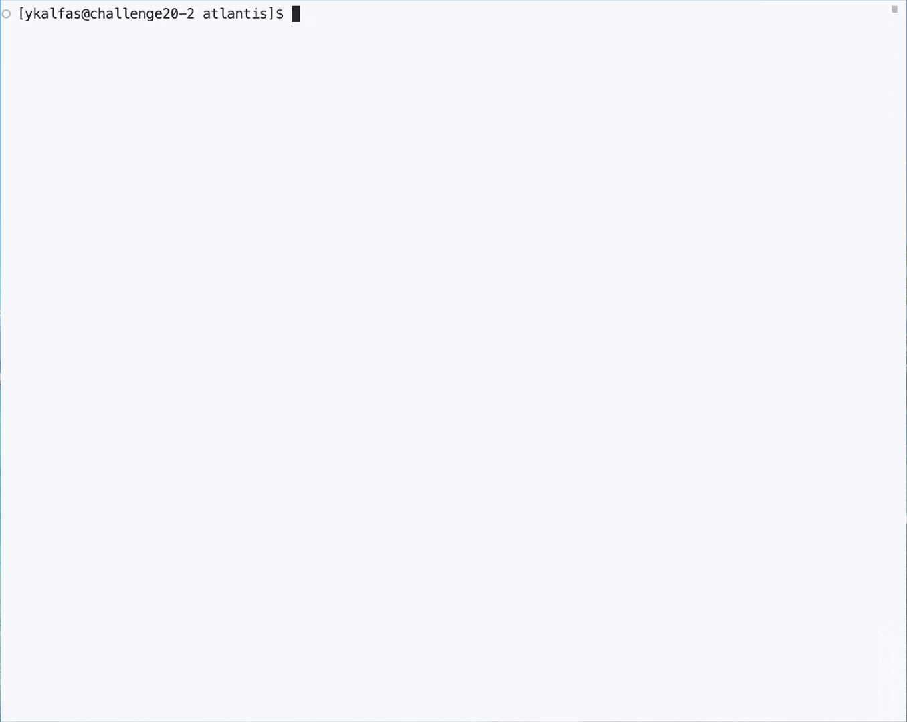

<div align="center" markdown="1">

# Atlantis


ML-ready archive of satellite-derived flood inundation observations
(ECMWF Code for Earth 2026).

Harmonised multi-source flood observations from **VIIRS** (optical),
**MODIS** (optical), and **GFM** (SAR), processed to a common 1-arcmin grid.
Access via CLI, Python API, or the Zarr/STAC archive for ML workflows.

[![Python versions][python-badge]][python-url]
[![Ruff][ruff-badge]][ruff-url]
[![Tests][tests-badge]][tests-url]
[![Docs][docs-badge]][docs-url]
[![Gitleaks status][gitleaks-badge]][gitleaks-url]

</div>

[python-badge]: https://img.shields.io/badge/python-3.11%20%7C%203.12%20%7C%203.13%20%7C%203.14-blue
[python-url]: https://github.com/ECMWFCode4Earth/atlantis
[ruff-badge]: https://img.shields.io/endpoint?url=https://raw.githubusercontent.com/astral-sh/ruff/main/assets/badge/v2.json
[ruff-url]: https://github.com/astral-sh/ruff
[tests-badge]: https://github.com/ECMWFCode4Earth/atlantis/actions/workflows/test.yml/badge.svg
[tests-url]: https://github.com/ECMWFCode4Earth/atlantis/actions/workflows/test.yml
[docs-badge]: https://github.com/ECMWFCode4Earth/atlantis/actions/workflows/docs.yml/badge.svg
[docs-url]: https://github.com/ECMWFCode4Earth/atlantis/actions/workflows/docs.yml
[gitleaks-badge]: https://github.com/ECMWFCode4Earth/atlantis/actions/workflows/gitleaks.yml/badge.svg
[gitleaks-url]: https://github.com/ECMWFCode4Earth/atlantis/actions/workflows/gitleaks.yml

## Quick Start

[Pixi](https://pixi.sh) installs **all** dependencies — including GDAL with
HDF4 support — from conda-forge in a single command. This is the recommended
path for all users:

```bash
pixi install       # resolve & install everything
pixi run setup     # bootstrap credentials & data assets
pixi run demo      # run the Valencia 2024 flood example
```



**New to Atlantis?** Start with [docs/pixi-setup.md](docs/pixi-setup.md) — single-command setup with GDAL + HDF4 out of the box.

**Contributor?** See [docs/development.md](docs/development.md) for `uv` setup, devcontainers, testing and CI.

> **`uv` users:** `uv` is also fully supported. See
> [docs/development.md](docs/development.md) for the contributor workflow,
> devcontainer setup, and CI instructions.

## Three ways to use Atlantis

### CLI

The commands you'll use most often:

- `pixi run setup` — bootstrap required data assets and credentials
- `pixi run demo` — run the Valencia 2024 flood example end-to-end
- `pixi run example-harvey-viirs` — Hurricane Harvey (VIIRS)
- `pixi run example-bihar-gfm` — Bihar floods (Sentinel-1 GFM)

For custom fetch commands, run `python -m atlantis.cli fetch` with the
`PYTHONPATH=src` prefix (all pixi tasks do this automatically). Add
`--verbose` before the subcommand for debug logging.

See [docs/cli.md](docs/cli.md) for the full CLI reference, [CLI_Examples.md](CLI_Examples.md)
for task-oriented walkthroughs, and `pixi task list` to list all available tasks.

### Python API

Use Atlantis programmatically for custom workflows. Each source (VIIRS, MODIS, GFM)
has a fetcher class and harmonisation utilities:

- [VIIRS API](docs/viirs/api.md) — fetch optical flood observations
- [MODIS API](docs/modis/api.md) — fetch water/flood composites
- [GFM API](docs/gfm/api.md) — fetch SAR flood extent

All three support harmonisation to a common 1-arcmin grid. Load results directly into xarray for analysis and ML pipelines.

### Archive

Build and query the consolidated Zarr/STAC archive for bulk ML workflows:

- [Zarr datacube spec](docs/archive/zarr-spec.md) — sharded storage schema, ML tiling, cloud-native access
- [STAC + visualization](docs/archive/stac-and-viz.md) — discovery layer and local hvplot/Panel dashboard

## Documentation

Browse the full documentation site locally (MkDocs + Material):

```bash
pixi run -e docs docs
```

Then open <http://localhost:8000>. Includes architecture guides, data-source
pipelines, CLI reference and batch-processing walkthroughs. For contributors
using `uv`:

```bash
uv sync --group docs && uv run mkdocs serve
```

## Credentials & data access

Most backends require a NASA Earthdata account. Run the setup script to be
guided through all of it:

```bash
pixi run setup
```

See [docs/setup.md](docs/setup.md) for a full description of each credential
(Earthdata token, LAADS Web pre-authorization, AWS profiles for GFM).

## Development

All contributor documentation — `uv` setup, devcontainers, running tests,
E2E workflow, CI triggers — is consolidated in
[docs/development.md](docs/development.md).
