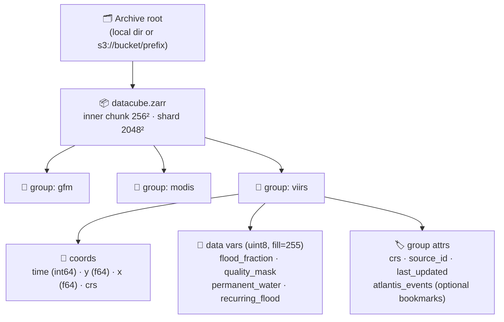
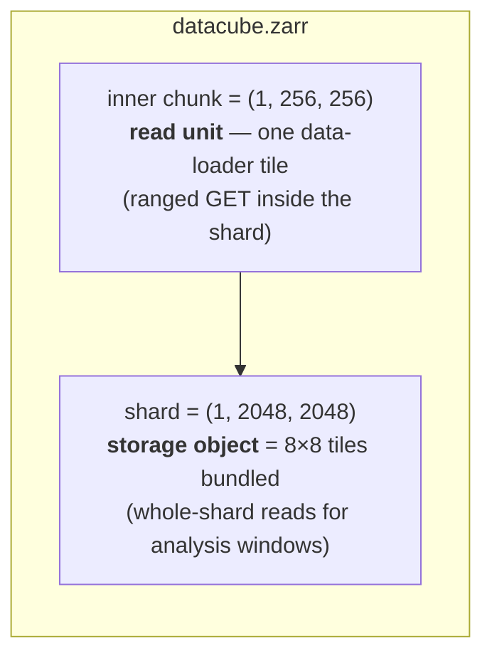
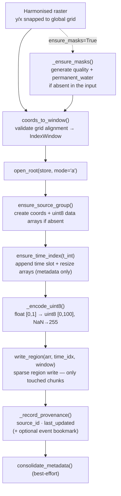
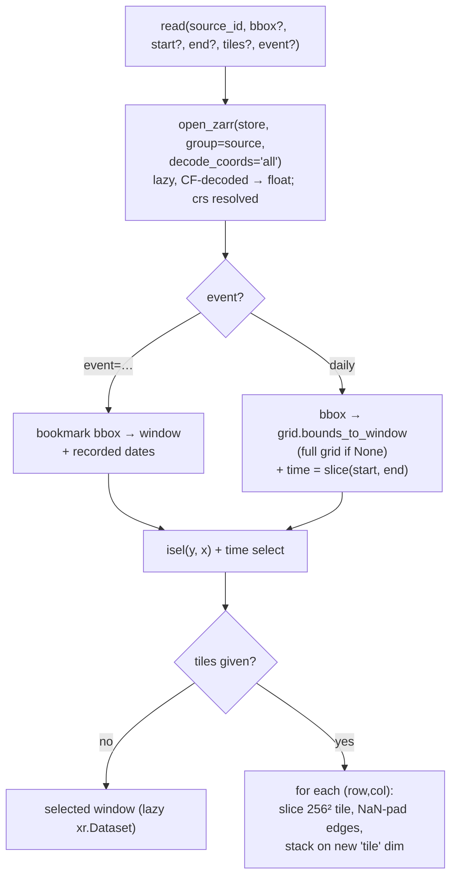

# Atlantis Zarr Datacube — Implementation Spec

> Review brief for the Machine Learning team. This document captures the
> **storage schema** and **data-flow** of the consolidated Zarr archive so it
> can be checked against ML data-loading standards (tiling granularity, dtypes,
> normalisation, random access, cloud reads).

Source of truth: [`src/atlantis/archive/`](../../src/atlantis/archive) —
`grid.py`, `datacube.py`, `writer.py`, `reader.py`, `_store.py`, plus
`ArchiveConfig` in [`src/atlantis/config.py`](../../src/atlantis/config.py#L101).

---

## 1. Overview

The archive is a **single sharded Zarr v3 store** (`datacube.zarr`), with **one
group per source** (`gfm`, `modis`, `viirs`, …), all co-registered on a shared
**canonical global 1-arcmin grid** (EPSG:4326).

| Store | Channels | Inner chunk | Shard | Serves |
| --- | --- | --- | --- | --- |
| `datacube.zarr` | `flood_fraction`, `quality_mask`, `permanent_water` (+ `recurring_flood`, MODIS) | `256²` | `2048²` | analysis (whole-shard windows) **and** ML (random `256²` tiles) |

One sharded store serves both jobs: Zarr v3 sharding decouples the **read unit**
(256² inner chunk — a data-loader tile, fetched by ranged GET) from the **object
unit** (2048² shard — a few large cloud objects for analysis windows). There is
no separate ML store; an ML-ready *view* is produced on read
(`read(..., tiles=…)`) or, in future, as an on-demand derived snapshot.

Each `(source, date)` AOI is placed into the global grid by an **integer-index
region write**, so the grid stays **sparse** — only inner chunks overlapping an
event ever materialise on disk/S3.



---

## 2. Canonical global grid

Defined once in [`grid.py`](../../src/atlantis/archive/grid.py) and shared by
every source group. Identical to the grid used by ECMWF
`Globe_flood_area_*.grb` / `CMF_all.zarr`, so outputs stack with global
products.

| Property | Value |
| --- | --- |
| CRS | `EPSG:4326` (WGS84 lat/lon) |
| Resolution | `1/60°` = 1 arc-minute (≈ 1.85 km at equator) |
| Shape | `10800` rows (lat, N→S) × `21600` cols (lon, W→E) |
| Origin | west edge `-180°`, north edge `+90°` |
| Pixel convention | **pixel-centre**: `lon = -180 + (i+0.5)/60`, `lat = +90 - (j+0.5)/60` |
| Row order | north → south (latitude decreases with row index) |

AOI bounds snap **outward** to the nearest grid edges (`snap_bounds`), mirroring
the harmoniser's `snap_to_global_grid`, then map to a half-open integer
`IndexWindow(row_start, row_stop, col_start, col_stop)`.

---

## 3. Group schema (per source)

Every source group has the same structure. Dimensions are `(time, y, x)`.

### 3.1 Coordinates

| Name | Dtype | Shape | Chunk | Key attributes |
| --- | --- | --- | --- | --- |
| `time` | `int64` | `(T,)` append-only | `512` | `units="days since 2020-01-01"`, `calendar="proleptic_gregorian"`, `standard_name="time"` |
| `y` | `float64` | `(10800,)` | `10800` | `standard_name="latitude"`, `units="degrees_north"`, `axis="Y"` |
| `x` | `float64` | `(21600,)` | `21600` | `standard_name="longitude"`, `units="degrees_east"`, `axis="X"` |
| `crs` | `int64` | `()` scalar | — | CF grid mapping (`grid_mapping_name`, `crs_wkt`, `spatial_ref`) → `EPSG:4326` |

`time` starts empty (`T=0`) and grows as a **metadata-only resize**; each unique
date adds one slot.

### 3.2 Data variables

All data variables are **`uint8`** with **`fill_value = 255`** (`NODATA`), dims
`(time, y, x)`, `grid_mapping="crs"`. The three **core channels** are shared
across all sources (Issue #63); `recurring_flood` is a MODIS-only extension.

| Variable | Source | Encoding | Notes |
| --- | --- | --- | --- |
| `flood_fraction` | all | `scale_factor=0.01`, `add_offset=0.0`, `units="1"` | stored `[0, 100]` → decodes to float `[0, 1]` |
| `quality_mask` | all | raw `uint8` codes | validity / cloud / snow flags |
| `permanent_water` | all | raw `uint8` (0/1) | binary mask |
| `recurring_flood` | modis | raw `uint8` | MODIS-specific extension |

**uint8 encoding** (`_encode_uint8`): float `flood_fraction ∈ [0,1]` →
`round(v*100) ∈ [0,100]` (percent), `NaN → 255`; integer masks pass through.
This is 4× smaller than float32 and CMF-comparable after CF decode.

> **Implementation caveats (verified against the store):**
> - **Channels follow the input.** `write()` stores exactly the variables present
>   in the harmonised input. The harmoniser emits all three core channels, so the
>   canonical (harmonise → write) path yields `flood_fraction` + `quality_mask` +
>   `permanent_water`. The CLI archive-from-tif path supplies single-band
>   `flood_fraction`; pass `--ensure-masks` (writer `ensure_masks=True`) to
>   synthesise the masks when absent.
> - **Mask dtype on read.** Every variable carries `_FillValue=255`, so a default
>   `open_zarr` (CF decode on) returns **float64 with `NaN`** for *all* variables
>   — masks included — not `uint8`. Use `mask_and_scale=False` for raw `uint8`.
> - **`grid_mapping="crs"` resolves to a real variable.** Each group holds a
>   scalar `crs` grid-mapping variable (CF attrs from `pyproj.CRS.to_cf()` plus a
>   `spatial_ref` WKT). Open with `decode_coords="all"` — the archive reader does
>   this — so `ds.rio.crs → EPSG:4326`. The group attribute `crs="EPSG:4326"`
>   remains as a human-readable convenience.

### 3.3 Codecs (on-disk)

`bytes` + **`zstd`** (`level=0`, `checksum=false`) for every array (Zarr v3
codec pipeline).

### 3.4 Group attributes — provenance & optional bookmarks

Group attributes are **bounded** (fixed keys, never per-write growth):

| Attribute | Purpose |
| --- | --- |
| `crs` | human-readable CRS string (`"EPSG:4326"`); distinct from the scalar `crs` grid-mapping *variable* in §3.1 |
| `source_id` | the source this group holds |
| `last_updated` | ISO timestamp of the most recent write |
| `atlantis_events` | **optional** named-event bookmarks — empty `{}` for the daily archive |

The **daily archive is label-free**: routine writes record only `source_id` /
`last_updated` and leave `atlantis_events` empty. Access is by `(source, time,
space)` — temporal selection on the `time` axis, spatial selection from a bbox
mapped to an index window via `grid.bounds_to_window`. No registry is scanned.

**Optional event bookmarks** are a convenience overlay for case studies /
benchmarks, written *only* when an explicit `event` is passed to `write()`. They
store just a bbox + dates (the reader derives the window from the bbox), so the
schema is bounded by the number of distinct named events:

```jsonc
"atlantis_events": {
  "Valencia_2024": {
    "bbox": [-1.5167, 38.7833, 0.5167, 40.0167],
    "dates": ["2024-10-30", "2024-10-31"],
    "updated_at": "2026-06-26T12:00:00+00:00"
  }
}
```

`read(source, event="Valencia_2024")` resolves the bookmark (bbox → window,
dates → time selection); the daily pipeline never writes here.

---

## 4. Chunking, sharding & access granularity



| Concern | datacube |
| --- | --- |
| Read unit (inner chunk) | `256²` tile (power-of-two, `/32`-friendly for U-Nets) |
| Object unit (shard) | `2048²` shard = 64 inner tiles in one object |
| Sparsity | only inner chunks overlapping an AOI materialise (within their shard) |
| Write concurrency | **single coordinator** — `write()` resizes the time axis, records bounded provenance and consolidates; intra-timestep writes mosaic per `(source, date)`. Parallelism is across the *produce* step (e.g. Dask) and across dates. |

Config knobs ([`ArchiveConfig`](../../src/atlantis/config.py#L101)):
`store="datacube.zarr"`, `chunk_size=256`, `shard_size=2048`,
`scale_factor=0.01`, `time_epoch="2020-01-01"`.

---

## 5. Write data-flow



- `write(dataset, source, *, time=None, ensure_masks=False, event=None)` → the
  consolidated cube. **Single-coordinator**: it mutates shared metadata
  (time-axis resize, bounded provenance, consolidation). For parallel backfill,
  run the expensive produce step in parallel (e.g. Dask) and funnel results to
  one writer — see `scripts/validate_viirs_zarr.py`.
- `ensure_masks=True` synthesises `quality_mask` / `permanent_water` when the
  input lacks them (e.g. a single-band `flood_fraction` tif).
- `event=…` (optional) registers a named bookmark; the daily pipeline omits it.

---

## 6. Read / ML loading path



The `tiles=[(row, col), …]` argument returns fixed `256²` tiles stacked on a
`tile` dimension, with edge tiles NaN-padded — the intended batch unit for a
PyTorch `Dataset`/`DataLoader`. (`validation/ml_loader.py` smoke-tests are
stubbed — open item, see §8.)

---

## 7. Storage backends

[`_store.py`](../../src/atlantis/archive/_store.py) resolves a layer name under
the archive root to a Zarr-v3 store:

- **Local**: `Path(root) / "datacube.zarr"` — directory store.
- **Remote**: `s3://bucket/prefix` → `zarr.storage.FsspecStore` via fsspec,
  with `storage_options` (credentials / `anon` / endpoint).

The same code path serves `zarr.open_group` and `xarray.open_zarr`; metadata is
consolidated for fast remote opens.

---

## 8. Points for ML review

1. **Tile size `256²`, dtype `uint8`** — confirm this matches model input
   expectations (patch size, `/32` divisibility for U-Net encoders).
2. **Normalisation** — `flood_fraction` decodes to float `[0, 1]` via CF
   `scale_factor` (the archive applies **no** per-image rescale; values are
   already physical `[0,1]`). Masks decode to **float64 with `NaN`** under default
   CF decoding (they carry `_FillValue=255`); read with `mask_and_scale=False` for
   categorical `uint8`. Is `[0,1]` the desired target range, or is per-channel
   standardisation expected upstream (a future on-demand derived view)?
3. **NODATA = 255 / NaN padding** — edge tiles and missing data surface as
   `NaN` after decode. Confirm the masking/ignore-index convention for losses.
4. **Random access** — `256²` chunks inside `2048²` shards: fine-grained tile
   reads vs. few large S3 objects. Validate against the DataLoader sampling
   pattern (shuffled tiles vs. contiguous windows).
5. **Channels** — `flood_fraction`, `quality_mask`, `permanent_water`
   (+ `recurring_flood` for MODIS). Confirm the channel stack and whether masks
   are model inputs or supervision only.
6. **Loader stubs** — `MLLoaderValidator` (`Dataset`/`DataLoader`/GPU transfer)
   is not yet implemented; we can shape it to the team's reference loader.
