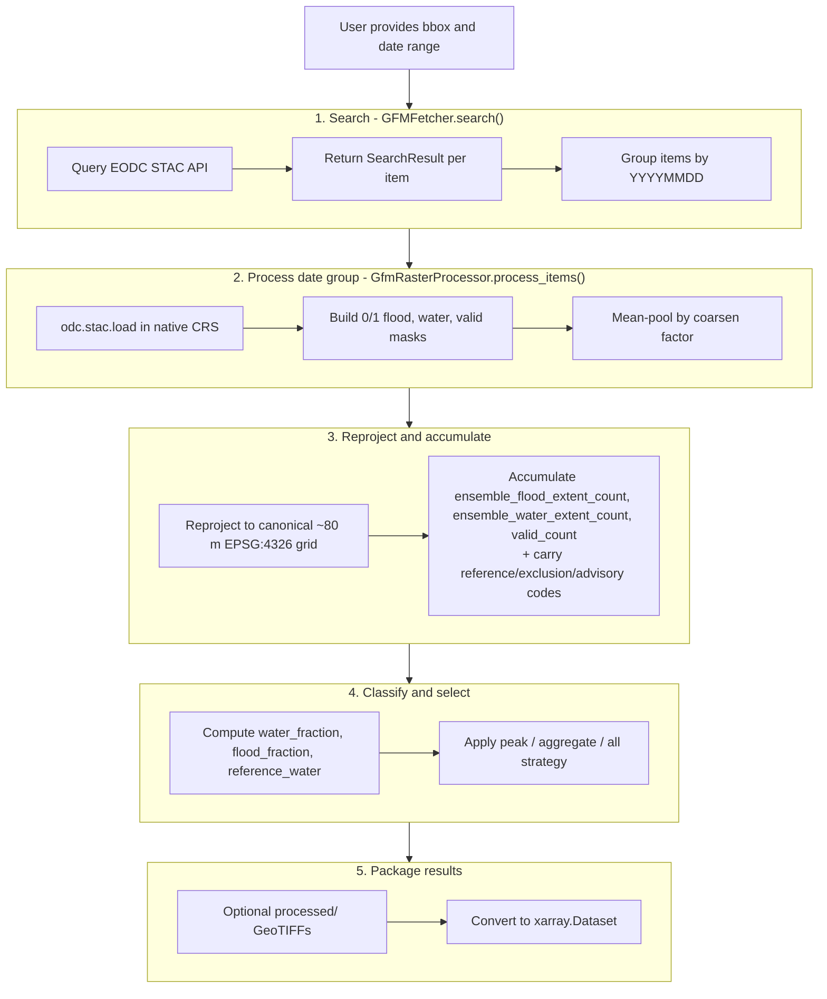

# GFM Internals

Developer-facing documentation for the GFM fetcher architecture and processing
pipeline. For usage, see [overview.md](overview.md) and [api.md](api.md).

## Architecture

```
┌─────────────────────────────────────────────────────────┐
│                      GFMFetcher                         │
│                 (orchestrates the flow)                 │
└─────────────┬───────────────────────┬───────────────────┘
              │                       │
              ▼                       ▼
┌─────────────────────┐    ┌────────────────────────┐
│   Backend Layer     │    │   GfmRasterProcessor   │
│                     │    │                        │
│ • GfmStacBackend    │    │ • Load STAC items      │
│   (EODC STAC)       │    │ • Classified: coarsen, │
│                     │    │   build masks, accum.  │
│ Handles:            │    │ • Native: NN-reproject  │
│ • STAC search       │    │   codes, max-pool      │
│ • Item grouping     │    │ • Write GeoTIFFs       │
└─────────────────────┘    └────────────────────────┘
```

## Current upstream asset scope

The EODC `GFM` collection advertises more assets than Atlantis currently uses.
Today the fetcher loads only:

- `ensemble_flood_extent`
- `reference_water_mask`

Atlantis now exposes the core native GFM bands plus the auxiliary
`ensemble_water_extent`, `exclusion_mask`, `ensemble_likelihood`, and
`advisory_flags` layers. The algorithm-specific DLR / TUW / LIST intermediate
flood-extent and likelihood assets remain unexposed.

The classified pipeline keeps the shared semantics narrow and explicit:
`water_fraction` comes from accumulated water coverage, `flood_fraction` comes
from accumulated flood coverage, and `reference_water` carries the native
reference-water codes under the shared layer name. The fetcher does not fold
`advisory_flags` or `exclusion_mask` into a single shared validity layer;
those codes are surfaced as companion layers instead.

## Processing pipeline

When you run `atlantis fetch --source gfm`, Atlantis executes a date-grouped
SAR pipeline. The processor supports two modes controlled by `classify`
(default `True`):

- **Classified mode** (`--classify`, default): builds 0/1 flood/water/valid
  masks, mean-pools them by the coarsen factor, reprojects with average
  resampling, accumulates counts, and derives `water_fraction` /
  `flood_fraction` / `reference_water` while carrying native-code companions
  such as `exclusion_mask`, `ensemble_likelihood`, and `advisory_flags`.
- **Native / raw mode** (`--no-classify`): NN-reprojects discrete pixel codes
  directly to the canonical grid and max-pools codes across items for each date;
  emits `ensemble_flood_extent` and `reference_water_mask` as-is.

### End-to-end flow



### Code trace

Call chain for a single request:

- `GFMFetcher.search()` in `__init__.py` delegates STAC discovery to
  `GfmStacBackend.search()`.
- `GFMFetcher.fetch()` in `__init__.py` groups items by date via
  `GfmStacBackend.group_items_by_date()` and instantiates `GfmRasterProcessor`.
- `GfmRasterProcessor.process_items()` in `processor.py` dispatches to
  `_process_items_classified()` (default) or `_process_items_native()` based on
  the `classify` flag.
- `GFMFetcher._apply_peak_window()` and `_apply_strategy()` in `__init__.py`
  select the final date set and build `FetchResult` objects.
- `processed_tile_to_dataset()` in `dataset.py` converts `GfmProcessedTile`
  into a georeferenced `xarray.Dataset` with either classified or native variables.

## Stage 1 - Search and grouping

`GfmStacBackend` is intentionally small. It wraps the EODC STAC API with three
responsibilities:

| Responsibility         | Implementation                              |
| ---------------------- | ------------------------------------------- |
| STAC endpoint defaults | `DEFAULT_GFM_STAC_URL`, `GFM_COLLECTION_ID` |
| Item search            | `GfmStacBackend.search()`                   |
| Per-date grouping      | `GfmStacBackend.group_items_by_date()`      |

The search step converts the event bbox into a Shapely polygon, queries the
STAC collection, and returns one `SearchResult` per item. Grouping is date-only:
all items with the same `YYYYMMDD` token are processed together.

## Stage 2 - Native load and coarsen (classified mode)

The processor loads each STAC item in its native projected CRS and native
ground sampling distance using `odc.stac.load()`. The first item provides the
source CRS and GSD used for the group. This is still upstream source space,
not Atlantis' ~80 m processed grid yet.

### Why mean-pool the masks?

Sentinel-1 SAR is noisy at native resolution. In classified mode,
`GfmRasterProcessor` builds the per-class 0/1 masks at native resolution and
**mean-pools** them before reprojection:

```python
flood_mask = (xx["ensemble_flood_extent"] == GFM_FLOOD).coarsen(...).mean()
water_mask = (xx["ensemble_water_extent"] == GFM_WATER).coarsen(...).mean()
```

Each coarsened cell holds the _fraction_ of sub-pixels in the class — the
correct way to downsample nominal codes, and consistent with the `average`
reproject that follows. A categorical `max` on the raw codes would rank them by
number and, because nodata = 255 is the largest, let a single nodata sub-pixel
erase flood in its block. The default factor is `4`, turning native ~20 m
pixels into an effective ~80 m grid while suppressing speckle.

In **native / raw mode** no mask/mean step is performed. Each item's
raw uint8 codes are NN-reprojected directly to the ~80 m processed grid and
accumulated via masked-max (`_masked_max()`). `--gfm-coarsen-factor` still sets
that grid's spacing; the downstream `--harmonise` step resamples to 1-arcmin.

## Stage 3 - Binary masks before reprojection (classified mode only)

GFM uses discrete codes, so classification happens before reprojection. The
processor builds three float32 masks at native resolution, then mean-pools them
by the coarsen factor:

| Mask    | Rule                                                                              |
| ------- | --------------------------------------------------------------------------------- |
| `flood` | `ensemble_flood_extent == 1`                                                      |
| `water` | `ensemble_water_extent == 1`                                                      |
| `valid` | Any of the three core bands is not `255` (flood, water, or `reference_water_mask`) |

Mean-pooling the 0/1 masks (rather than `max`-pooling the nominal codes) keeps
discrete classes meaningful and avoids nodata dominating mixed blocks. After
reprojection with `average`, each mask becomes a coverage fraction on the
output grid.

The important implication is that none of the public Atlantis outputs is a
direct rename of an upstream GFM asset. All three are derived products built
from those binary masks.

## Stage 4 - Canonical-grid reprojection and accumulation (classified mode only)

The processor pre-computes a snapped ~80 m destination grid for the event
bbox using `Reprojector._snap_bounds_to_global_grid()`. Every item is then
reprojected onto exactly that grid.


The three count arrays are:

- `ensemble_flood_extent_count` (accumulated from native `ensemble_flood_extent`)
- `ensemble_water_extent_count` (accumulated from native `ensemble_water_extent`)
- `valid_count` (accumulated validity of any of the three core bands: `ensemble_flood_extent`, `ensemble_water_extent`, `reference_water_mask`)

Each item contributes a fractional amount in `[0, 1]` to those accumulators.
These are the exact keys exposed on the `DerivationContext` passed to the
derived-layer functions (see `gfm/layers.py` and `gfm/derived.py`).

## Stage 5 - Classification (classified mode only)

`GfmRasterProcessor._classify()` converts the accumulated counts into the final
**derived** layers. The per-layer maths is declared in
`src/atlantis/fetchers/gfm/derived.py` and registered on the GFM layer registry
(`gfm/layers.py`); unlike VIIRS/MODIS, the GFM derivations read accumulated
_counts_ rather than raw codes. Browse them with `atlantis list-layers --source gfm`
or in the canonical [GFM derived layer reference](../layers.md#layers-gfm-derived).

$$
\mathrm{water\_fraction} = \frac{\text{ensemble\_water\_extent\_count}}{\text{valid\_count}}
$$

with `NaN` where `valid_count == 0`.

$$
\text{flood\_fraction} = \frac{\text{ensemble\_flood\_extent\_count}}{\text{valid\_count}}
$$

with `NaN` where `valid_count == 0`.

$$
\mathrm{reference\_water} = \text{reference\_water\_mask\_codes}
$$

`exclusion_mask`, `advisory_flags`, and `ensemble_likelihood` are preserved as
native-code companion layers; they are not used to derive the shared
`water_fraction` / `flood_fraction` maths.

`cloud_fraction` is computed as the fraction of pixels with no valid coverage.

## Strategy layer

The fetcher supports the same three top-level strategies exposed in the docs:

| Strategy    | Implementation          | Behavior                                                       |
| ----------- | ----------------------- | -------------------------------------------------------------- |
| `peak`      | `_strategy_peak()`      | Pick the date with the highest `flood_pixel_count()`           |
| `aggregate` | `_strategy_aggregate()` | Mean flood fraction, OR quality, majority-vote permanent water |
| `all`       | `_strategy_all()`       | Keep one `FetchResult` per date                                |

Peak-window filtering and observation subsampling live in
`selection.py`:

- `select_peak_window()` keeps only dates inside a ±N-day window around the peak.
- `subsample_around_peak()` enforces `max_observations` with `post`, `pre`, or
  `balanced` priority.

## Dataset conversion

`processed_tile_to_dataset()` in `dataset.py` converts each `GfmProcessedTile`
into a georeferenced `xarray.Dataset`. It derives pixel-center coordinates from
the affine transform and writes both CRS and transform via `rioxarray`.

The result is the in-memory payload returned through `FetchResult.dataset`.
When `keep_processed=True`, the written `processed/` GeoTIFFs are already on
the same ~80 m grid as the in-memory dataset. The `--harmonise` step is what
resamples them down to the canonical 1-arcmin grid.

## Edge cases

| Scenario                                  | Behavior                                                 |
| ----------------------------------------- | -------------------------------------------------------- |
| No STAC items match the event             | `fetch()` returns `[]` early                             |
| STAC items have no datetime               | `group_items_by_date()` skips them                       |
| A date group produces no valid data       | `process_items()` returns `None` and the date is skipped |
| Tied peak flood counts                    | The earliest date wins                                   |
| Non-date tokens enter peak-window helpers | They are excluded by `_parse_yyyymmdd()`                 |
| Aggregate strategy on a single date       | `aggregate_tiles()` returns that tile unchanged          |
| `--no-classify` with `--plot`             | Plots `ensemble_flood_extent` codes as a raw raster      |
| `--no-classify` with `--harmonise`        | NN-reprojects codes to 1-arcmin; no flood % derivation   |

## Test anchors

- [test_gfm.py](../../tests/fetchers/test_gfm.py) - fetcher defaults, backend wiring,
  registration, and protocol compliance
- [test_gfm_processor.py](../../tests/fetchers/test_gfm_processor.py) - `_classify()`,
  file writing, and aggregate behavior
- [test_gfm_selection.py](../../tests/fetchers/test_gfm_selection.py) - peak-window and
  subsampling logic
- [test_gfm_e2e.py](../../tests/fetchers/test_gfm_e2e.py) - CLI-level reference checks
