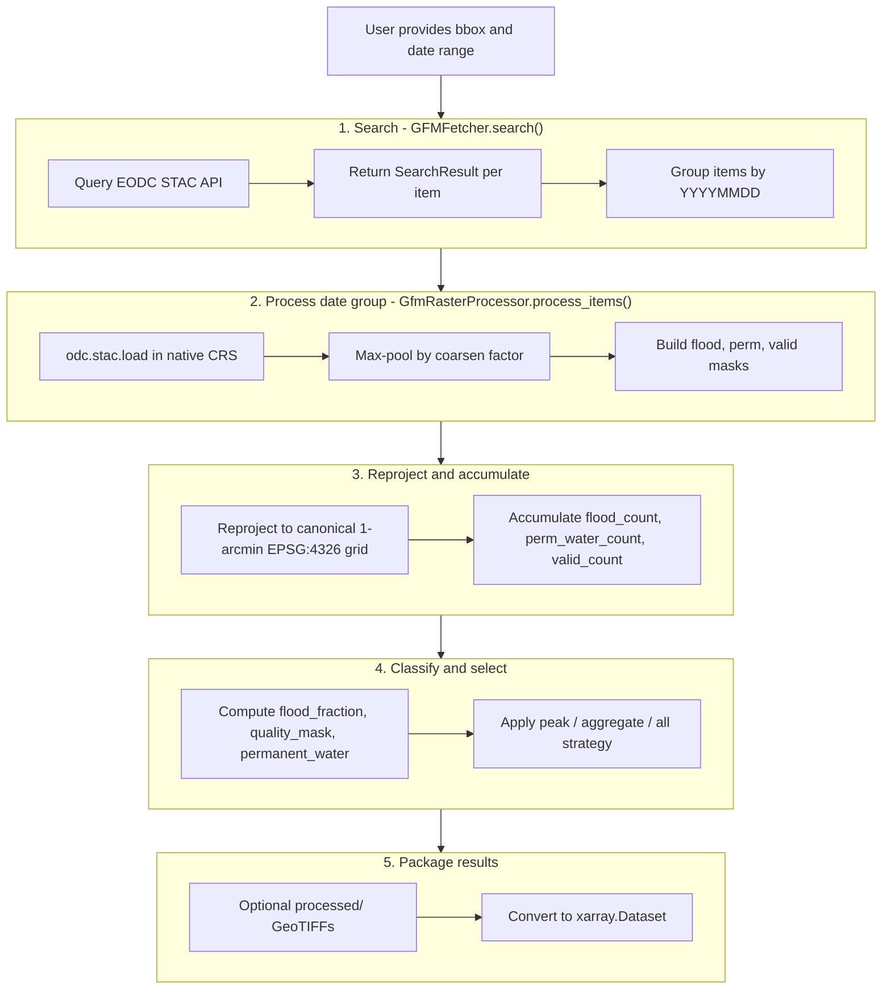

# GFM Internals

Developer-facing documentation for the GFM fetcher architecture and processing
pipeline. For usage, see [overview.md](overview.md) and [api.md](api.md).

## Architecture

```
┌─────────────────────────────────────────────────────────┐
│                      GFMFetcher                         │
│                 (orchestrates the flow)                 │
└─────────────┬───────────────────────┬───────────────────┘
              │                       │
              ▼                       ▼
┌─────────────────────┐    ┌────────────────────────┐
│   Backend Layer     │    │   GfmRasterProcessor   │
│                     │    │                        │
│ • GfmStacBackend    │    │ • Load STAC items      │
│   (EODC STAC)       │    │ • Coarsen native SAR   │
│                     │    │ • Build binary masks   │
│ Handles:            │    │ • Reproject + align    │
│ • STAC search       │    │ • Accumulate counts    │
│ • Item grouping     │    │ • Write GeoTIFFs       │
└─────────────────────┘    └────────────────────────┘
```

## Processing pipeline

When you run `atlantis fetch --source gfm`, Atlantis executes a date-grouped
SAR pipeline. The backend searches the EODC STAC API, groups items by
acquisition date, and the raster processor turns each date group into aligned
`flood_fraction`, `quality_mask`, and `permanent_water` layers.

### End-to-end flow



### Code trace

Call chain for a single request:

- `GFMFetcher.search()` in `__init__.py` delegates STAC discovery to
  `GfmStacBackend.search()`.
- `GFMFetcher.fetch()` in `__init__.py` groups items by date via
  `GfmStacBackend.group_items_by_date()` and instantiates `GfmRasterProcessor`.
- `GfmRasterProcessor.process_items()` in `processor.py` performs load,
  coarsen, reprojection, accumulation, and optional file writing.
- `GFMFetcher._apply_peak_window()` and `_apply_strategy()` in `__init__.py`
  select the final date set and build `FetchResult` objects.
- `processed_tile_to_dataset()` in `dataset.py` converts `GfmProcessedTile`
  into a georeferenced `xarray.Dataset`.

## Stage 1 - Search and grouping

`GfmStacBackend` is intentionally small. It wraps the EODC STAC API with three
responsibilities:

| Responsibility         | Implementation                              |
| ---------------------- | ------------------------------------------- |
| STAC endpoint defaults | `DEFAULT_GFM_STAC_URL`, `GFM_COLLECTION_ID` |
| Item search            | `GfmStacBackend.search()`                   |
| Per-date grouping      | `GfmStacBackend.group_items_by_date()`      |

The search step converts the event bbox into a Shapely polygon, queries the
STAC collection, and returns one `SearchResult` per item. Grouping is date-only:
all items with the same `YYYYMMDD` token are processed together.

## Stage 2 - Native load and coarsen

The processor loads each STAC item in its native CRS and native ground sampling
distance using `odc.stac.load()`. The first item provides the source CRS and GSD
used for the group.

### Why coarsen first?

Sentinel-1 SAR is noisy at native resolution. `GfmRasterProcessor` applies a
max-pool coarsen step before reprojection:

```python
flood_native = xx["ensemble_flood_extent"].coarsen(...).max()
perm_native = xx["reference_water_mask"].coarsen(...).max()
```

That preserves the flood signal while reducing speckle and runtime. The default
factor is `4`, which turns native ~20 m pixels into an effective ~80 m grid.

## Stage 3 - Binary masks before reprojection

GFM uses discrete codes, so classification happens before reprojection. The
processor builds three float32 masks on the coarsened native grid:

| Mask    | Rule                            |
| ------- | ------------------------------- |
| `flood` | `ensemble_flood_extent == 1`    |
| `perm`  | `reference_water_mask == 2`     |
| `valid` | Either source band is not `255` |

This avoids averaging discrete class codes directly. After reprojection with
`average`, each mask becomes a coverage fraction on the output grid.

## Stage 4 - Canonical-grid reprojection and accumulation

The processor pre-computes a snapped 1-arcmin destination grid for the event
bbox using `Reprojector._snap_bounds_to_global_grid()`. Every item is then
reprojected onto exactly that grid.


The three count arrays are:

- `flood_count`
- `perm_water_count`
- `valid_count`

Each item contributes a fractional amount in `[0, 1]` to those accumulators.

## Stage 5 - Classification

`GfmRasterProcessor._classify()` converts the accumulated counts into the final
public layers:

$$
\text{flood\_fraction} = \frac{\text{flood\_count}}{\text{valid\_count}}
$$

with `NaN` where `valid_count == 0`.

$$
\text{quality\_mask} = \mathbb{1}[\text{valid\_count} > 0]
$$

$$
\text{permanent\_water} = \mathbb{1}\left[\frac{\text{perm\_water\_count}}{\text{valid\_count}} > 0.5\right]
$$

`cloud_fraction` is computed as the fraction of pixels with no valid coverage.

## Strategy layer

The fetcher supports the same three top-level strategies exposed in the docs:

| Strategy    | Implementation          | Behavior                                                       |
| ----------- | ----------------------- | -------------------------------------------------------------- |
| `peak`      | `_strategy_peak()`      | Pick the date with the highest `flood_pixel_count()`           |
| `aggregate` | `_strategy_aggregate()` | Mean flood fraction, OR quality, majority-vote permanent water |
| `all`       | `_strategy_all()`       | Keep one `FetchResult` per date                                |

Peak-window filtering and observation subsampling live in
`selection.py`:

- `select_peak_window()` keeps only dates inside a ±N-day window around the peak.
- `subsample_around_peak()` enforces `max_observations` with `post`, `pre`, or
  `balanced` priority.

## Dataset conversion

`processed_tile_to_dataset()` in `dataset.py` converts each `GfmProcessedTile`
into a georeferenced `xarray.Dataset`. It derives pixel-center coordinates from
the affine transform and writes both CRS and transform via `rioxarray`.

The result is the in-memory payload returned through `FetchResult.dataset`.

## Edge cases

| Scenario                                  | Behavior                                                 |
| ----------------------------------------- | -------------------------------------------------------- |
| No STAC items match the event             | `fetch()` returns `[]` early                             |
| STAC items have no datetime               | `group_items_by_date()` skips them                       |
| A date group produces no valid data       | `process_items()` returns `None` and the date is skipped |
| Tied peak flood counts                    | The earliest date wins                                   |
| Non-date tokens enter peak-window helpers | They are excluded by `_parse_yyyymmdd()`                 |
| Aggregate strategy on a single date       | `aggregate_tiles()` returns that tile unchanged          |

## Test anchors

- [test_gfm.py](../../tests/fetchers/test_gfm.py) - fetcher defaults, backend wiring,
  registration, and protocol compliance
- [test_gfm_processor.py](../../tests/fetchers/test_gfm_processor.py) - `_classify()`,
  file writing, and aggregate behavior
- [test_gfm_selection.py](../../tests/fetchers/test_gfm_selection.py) - peak-window and
  subsampling logic
- [test_gfm_e2e.py](../../tests/fetchers/test_gfm_e2e.py) - CLI-level reference checks
