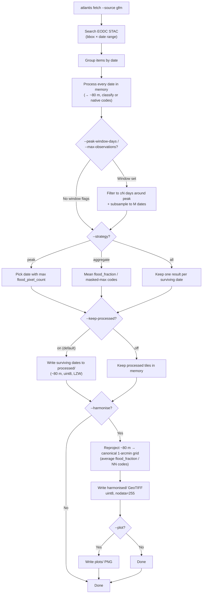

# GFM Pipeline Reference

Technical reference for Atlantis' GFM CLI, processing steps, output formats,
and configuration. For the user-facing introduction, quick start, and data
source overview, see [overview.md](overview.md).

## Decision flowchart



## Mode summary

| Strategy    | Best for                                    | Result shape                         |
| ----------- | ------------------------------------------- | ------------------------------------ |
| `peak`      | Single representative flood date            | One `FetchResult`                    |
| `aggregate` | Multi-item or multi-date coverage smoothing | One aggregated `FetchResult`         |
| `all`       | Time-series analysis                        | One `FetchResult` per surviving date |

| Flag combination      | Effect                                           |
| --------------------- | ------------------------------------------------ |
| `--no-keep-processed` | Skip intermediate ~80 m outputs                  |
| `--harmonise`         | Write canonical 1-arcmin flood percentage raster |
| `--plot`              | Save PNG previews alongside raster outputs       |

## CLI reference

### `atlantis fetch --source gfm`

```bash
uv run atlantis fetch \
  --event <event_id> \
  --source gfm \
  --bbox "<west> <south> <east> <north>" \
  --start-date YYYY-MM-DD \
  --end-date YYYY-MM-DD \
  [flags]
```

### `atlantis harmonise --source gfm`

Resample previously fetched GFM outputs to a uniform 1-arcmin grid:

```bash
uv run atlantis harmonise \
  --event Valencia_2024 \
  --source gfm
```

## Flags

### Output control

| Flag                  | Default | Effect                                                                                                                                                                                                                  |
| --------------------- | ------- | ----------------------------------------------------------------------------------------------------------------------------------------------------------------------------------------------------------------------- |
| `--harmonise`         | off     | Reproject the ~80 m processed output to the canonical 1-arcmin grid. Classified: `average`-resample `flood_fraction` (uint8 %). Native: NN-resample the uint8 code bands. Use `--no-classify` to emit native SAR bands. |
| `--no-keep-processed` | off     | Write only the harmonised output (no intermediate ~80 m files)                                                                                                                                                          |
| `--plot`              | off     | Save a PNG of each result date                                                                                                                                                                                          |
| `--strategy`          | `peak`  | Multi-date reduction: `peak` (most-flooded date), `aggregate` (mean/mode composite), `all` (per-date outputs). Same default across all sources.                                                                         |

### Processing

| Flag                   | Default   | Effect                                                                                                                                             |
| ---------------------- | --------- | -------------------------------------------------------------------------------------------------------------------------------------------------- |
| `--gfm-coarsen-factor` | `4`       | Spatial coarsening factor before reprojection. Reduces native ~20 m to ~80 m by default. Higher values trade resolution for speed/noise reduction. |
| `--gfm-resampling`     | `average` | Resampling method when reprojecting to EPSG:4326. Any rasterio method name is accepted.                                                            |

### Harmonisation

| Flag                  | Default | Effect                                      |
| --------------------- | ------- | ------------------------------------------- |
| `--target-resolution` | 0.0167° | Target grid spacing (1 arcmin default)      |
| `--dry-run`           |         | Show what would be processed without acting |

## Pipeline in detail

The GFM processing pipeline operates per-date and per-item. Each STAC item
corresponds to a single Sentinel-1 acquisition over one Sentinel-2 tile
footprint. Multiple items can cover the same date and bbox.

> **Layers.** The exact GFM layer inventory is centralised in the canonical [layer reference](../layers.md#layers-gfm) and in `atlantis list-layers --source gfm`. This page only describes how classified vs native mode process those layers.

### Step-by-step

**Classified mode** (`--classify`, default)

```text
STAC search → group by date → per-item loop → coarsen → accumulate → derive products
                                    │
                    load (native CRS, ~20 m, odc.stac)
          build binary masks (flood, water, valid) at native res
                    mean-pool masks × coarsen_factor (→ per-class fractions)
                    reproject to canonical ~80 m EPSG:4326 grid (average)
                    │
        (ensemble_flood_extent_count, ensemble_water_extent_count, valid_count) ← accumulate
                    │
                    derive:
            water_fraction  = ensemble_water_extent_count / valid_count    [0, 1], NaN where unobserved
                        flood_fraction  = ensemble_flood_extent_count / valid_count    [0, 1], NaN where unobserved
            reference_water = reference_water_mask_codes    {0,1,2,255}
          carry native-code companions:
            exclusion_mask, advisory_flags, ensemble_likelihood
```

**Native / raw mode** (`--no-classify`)

```text
STAC search → group by date → per-item loop → NN-reproject codes → max-pool across items
                                    │
                    load (native CRS, ~20 m, odc.stac)
                    reproject raw uint8 codes to canonical ~80 m grid (nearest-neighbour)
                    │
                    masked-max accumulation across items:
                        ensemble_flood_extent  = max(valid codes) over items, nodata=255
            ensemble_water_extent  = max(valid codes) over items, nodata=255
                        reference_water_mask   = max(valid codes) over items, nodata=255
            exclusion_mask / ensemble_likelihood = max(valid codes) over items
            advisory_flags = bitwise OR over valid codes
```

In native mode no max-pool or binary-mask step is performed — codes are
NN-reprojected straight onto the ~80 m grid and preserved exactly.
`--gfm-coarsen-factor` still sets that grid's spacing (`20 m × factor`), but
`--gfm-resampling` is ignored (native codes always use nearest-neighbour).

#### Why binary masks before reprojection?

`ensemble_flood_extent` has discrete codes (0 = dry, 1 = flood, 255 = nodata).
Applying `Resampling.average` directly on these codes would produce fractional
intermediates like 0.5 — which cannot be reliably thresholded back to 0 or 1.
Instead, Atlantis converts to a float32 binary mask _first_ (at full native
resolution, where codes are still discrete), then reprojects with `average`
resampling. After reprojection each pixel contains the _fraction of its area_
that was flooded — exactly what we want to accumulate across items.

#### Why mean-pool the masks (not max-pool the codes)?

The GFM codes are **nominal categories**, so pooling them by numeric value is
meaningless — and because nodata = 255 is the largest code, a categorical `max`
would let a single nodata sub-pixel erase flood in its whole block. Instead
Atlantis builds the 0/1 flood / perm / valid masks at native resolution and
**mean-pools** them: each coarsened cell holds the _fraction_ of sub-pixels in
that class. This is the correct way to downsample categorical data, and it is
consistent with the `average` reprojection and count accumulation that follow.

#### Reprojection: ~80 m processed grid, 1-arcmin at harmonise

After computing the per-item binary masks in the native UTM CRS, Atlantis
reprojects each mask onto a **global EPSG:4326 grid at the coarsen-applied ~80 m
spacing** — snapped outward to whole cells of that grid. This `processed/`
output keeps GFM's full native detail (like VIIRS at 375 m or MODIS at 250 m).

The optional `--harmonise` step then resamples that ~80 m output down to the
**canonical 1-arcmin global grid** — the same grid used by ECMWF's
`Globe_flood_area_*.grb` and the VIIRS/MODIS harmonised outputs. After
harmonisation:

- The bbox is snapped outward to the nearest cell edge of the 1-arcmin grid.
- Every output pixel centre satisfies `(lon + 180) × 60 − 0.5 ∈ ℤ` and
  `(90 − lat) × 60 − 0.5 ∈ ℤ`.
- GFM, VIIRS, and MODIS harmonised outputs over the same AOI are **stackable**
  without any further resampling.

See [Canonical 1-arcmin global grid](../viirs/overview.md#canonical-1-arcmin-global-grid)
for the full alignment specification.

## Strategies in detail

### `peak` — single most-flooded date

Implemented in [`atlantis.fetchers.gfm.selection.flood_pixel_count`](../../src/atlantis/fetchers/gfm/selection.py).

For each date `d`, count the flooded pixels:

$$
\text{flood\_count}_d = \sum_{(i,j)} \mathbb{1}\!\left[\text{flood\_fraction}_d(i,j) > 0\right]
$$

(NaN pixels — where no valid observation exists — are excluded from the count.)
In native / raw mode the same count uses `ensemble_flood_extent(i,j) == 1`
as the flood indicator instead.

Pick:

$$
d^{\star} = \arg\max_d \text{flood\_count}_d
$$

Ties go to the **earliest** date (first to reach the max during iteration).
The output filename carries only the single winning date token, e.g.
`Valencia_2024_20241031_gfm_harmonised.tif`.

### `aggregate` — temporal composite

All dates are stacked and reduced element-wise by
[`atlantis.layers.aggregate_layer`](../../src/atlantis/layers/aggregation.py),
using the operator declared for each layer in the
[GFM layer registry](../layers.md#layers-gfm):

**Classified mode:**

| Layer                 | Operator     | Rationale                                                                |
| :-------------------- | :----------- | :----------------------------------------------------------------------- |
| `water_fraction`      | `nanmean`    | Continuous variable → arithmetic mean; NaN dates skipped per-pixel       |
| `flood_fraction`      | `nanmean`    | Continuous variable → arithmetic mean; NaN dates skipped per-pixel       |
| `reference_water`     | `masked_max` | Highest valid shared code wins; nodata=255 never dominates a mixed pixel |
| `exclusion_mask`      | `masked_max` | Preserve strongest valid exclusion code; nodata ignored                  |
| `ensemble_likelihood` | `masked_max` | Preserve strongest valid likelihood code; nodata ignored                 |
| `advisory_flags`      | `masked_or`  | Bitwise OR across valid observations; preserves every advisory bit seen  |
| `cloud_fraction`      | scalar       | Tile-level metadata (`1 − valid_pixels/total_pixels`)                    |

`nanmean` means pixels that were unobserved (NaN) on some dates are averaged
over the dates that _did_ observe them — no bias toward missing data.

**Native / raw mode:**

| Layer                   | Operator     | Rationale                                                          |
| :---------------------- | :----------- | :----------------------------------------------------------------- |
| `ensemble_flood_extent` | `masked_max` | Valid code always beats nodata (255); highest valid class wins     |
| `ensemble_water_extent` | `masked_max` | Valid code always beats nodata (255); highest valid class wins     |
| `reference_water_mask`  | `masked_max` | Highest valid class wins across dates; nodata never dominates      |
| `exclusion_mask`        | `masked_max` | Preserve strongest valid exclusion code                            |
| `ensemble_likelihood`   | `masked_max` | Preserve strongest valid likelihood code                           |
| `advisory_flags`        | `masked_or`  | Bitwise OR across valid observations; preserves every advisory bit |

> **Why `masked_max` / `masked_or` for GFM?** GFM uses `nodata=255` for unobserved
> pixels. A plain numeric `max` would let 255 win every mixed block, so the
> aggregation engine explicitly treats 255 as absent: a valid code always beats
> nodata, and `advisory_flags` are combined with bitwise OR so no flag is lost.

The output `date_token` spans the full range:
`{first_date}_{last_date}`, e.g. `20241030_20241101`. For a single date the
token is just `20241030`.

### `all` — every date independently

No reduction. Each date's processed tile becomes a separate `FetchResult` with
its own date token. When `--harmonise` is set, each date produces its own
harmonised GeoTIFF + PNG.

## Output structure

```
<output>/
  <event_id>/
    gfm/
      processed/    # absent with --no-keep-processed
        # Classified mode:
        <event_id>_<YYYYMMDD>_gfm_water_fraction.tif    # uint8 pct 0–100, nodata=255
        <event_id>_<YYYYMMDD>_gfm_flood_fraction.tif    # uint8 pct 0–100, nodata=255
        <event_id>_<YYYYMMDD>_gfm_reference_water.tif   # uint8 codes 0/1/2/255
        <event_id>_<YYYYMMDD>_gfm_exclusion_mask.tif    # uint8 native codes
        <event_id>_<YYYYMMDD>_gfm_advisory_flags.tif    # uint8 native bitmask
        <event_id>_<YYYYMMDD>_gfm_ensemble_likelihood.tif  # uint8 0–100
        # Native / raw mode (--no-classify):
        <event_id>_<YYYYMMDD>_gfm_ensemble_flood_extent.tif   # uint8, nodata=255
        <event_id>_<YYYYMMDD>_gfm_ensemble_water_extent.tif   # uint8, nodata=255
        <event_id>_<YYYYMMDD>_gfm_reference_water_mask.tif    # uint8, nodata=255
        <event_id>_<YYYYMMDD>_gfm_exclusion_mask.tif          # uint8 native codes
        <event_id>_<YYYYMMDD>_gfm_advisory_flags.tif          # uint8 native bitmask
        <event_id>_<YYYYMMDD>_gfm_ensemble_likelihood.tif     # uint8 0–100
      plots/
        processed/
          derived/      # --classify (default) + --plot
            <event_id>_<date_token>_gfm.png
          native/       # --no-classify + --plot
            <event_id>_<date_token>_gfm.png
        harmonised/
          derived/      # --classify (default) + --harmonise
            <event_id>_<date_token>_gfm_harmonised.png
          native/       # --no-classify + --harmonise
            <event_id>_<date_token>_gfm_harmonised.png
      harmonised/   # with --harmonise
        # Classified mode:
        <event_id>_<date_token>_gfm_harmonised.tif
        # Native / raw mode:
        <event_id>_<date_token>_gfm_ensemble_flood_extent_harmonised.tif
        <event_id>_<date_token>_gfm_reference_water_mask_harmonised.tif
```

## Data encoding at each stage

```
Source items (EODC STAC)      uint8   codes 0/1/255              ~20 m
        │
        ▼ classify (binary masks → mean-pool → average reproject)
Processed (--classify)        uint8   water pct 0–100            ~80 m, nodata=255
                              uint8   flood pct 0–100            ~80 m, nodata=255
                              uint8   reference_water codes      ~80 m, nodata=255
                              uint8   exclusion/advisory/etc.    ~80 m, nodata=255
        │
        ▼ harmonise
Harmonised                    uint8   flood pct 0–100            ~1 arcmin, nodata=255
                                      (average resampled)


Source items (EODC STAC)      uint8   codes 0/1/2/255            ~20 m
        │
        ▼ --no-classify (NN reproject codes)
Processed                     uint8   native GFM code bands      ~80 m, nodata=255
        │
        ▼ harmonise
Harmonised (raw)              uint8   same codes                 ~1 arcmin, nodata=255
                                      (nearest resampled, codes preserved)
```

This mirrors the VIIRS (375 m) and MODIS (250 m) ladders: a source-resolution
`processed/` output in uint8, then an optional resample to the shared canonical
1-arcmin grid at harmonise time.

## Output format

### Processed outputs — classified mode (~80 m, EPSG:4326)

| File                        | Dtype | Nodata | Values                                                              |
| --------------------------- | ----- | ------ | ------------------------------------------------------------------- |
| `*_water_fraction.tif`      | uint8 | 255    | 0–100 — % of obs water (`round(frac×100)`); 255 = no obs            |
| `*_flood_fraction.tif`      | uint8 | 255    | 0–100 — % of obs flooded (`round(frac×100)`); 255 = no obs          |
| `*_reference_water.tif`     | uint8 | 255    | 0 = no water, 1 = permanent water, 2 = seasonal water, 255 = nodata |
| `*_exclusion_mask.tif`      | uint8 | 255    | Native GFM exclusion-mask codes                                     |
| `*_advisory_flags.tif`      | uint8 | 255    | Native advisory bitmask                                             |
| `*_ensemble_likelihood.tif` | uint8 | 255    | Native ensemble likelihood values (0–100)                           |

### Processed outputs — native / raw mode (~80 m, EPSG:4326)

| File                          | Dtype | Nodata | Values                                                              |
| ----------------------------- | ----- | ------ | ------------------------------------------------------------------- |
| `*_ensemble_flood_extent.tif` | uint8 | 255    | 0 = dry, 1 = flood, 255 = nodata                                    |
| `*_ensemble_water_extent.tif` | uint8 | 255    | 0 = dry, 1 = water, 255 = nodata                                    |
| `*_reference_water_mask.tif`  | uint8 | 255    | 0 = no water, 1 = permanent water, 2 = seasonal water, 255 = nodata |
| `*_exclusion_mask.tif`        | uint8 | 255    | Native GFM exclusion-mask codes                                     |
| `*_advisory_flags.tif`        | uint8 | 255    | Native advisory bitmask                                             |
| `*_ensemble_likelihood.tif`   | uint8 | 255    | Native ensemble likelihood values (0–100)                           |

All processed outputs use **CRS**: EPSG:4326 (WGS84), **Compression**: LZW.

### Harmonised output (1 arcmin)

| Property        | Value                                                  |
| --------------- | ------------------------------------------------------ |
| **CRS**         | EPSG:4326 (WGS84)                                      |
| **Dtype**       | uint8                                                  |
| **Nodata**      | 255                                                    |
| **Values**      | 0–100 (flood fraction as integer percentage)           |
| **Resolution**  | 1/60° ≈ 1.85 km at the equator                         |
| **Grid**        | Canonical global grid, pixel centres at `±(k+0.5)/60°` |
| **Compression** | LZW                                                    |

Harmonised flood extent values are stored as **integer percentages** (0–100),
where 0 = no flood and 100 = fully flooded (same encoding as VIIRS harmonised
outputs). This gives 1% precision while using 4× less disk space than float32.

Compatible with `rioxarray`, `rasterio`, QGIS, and any GDAL-based tool.

Override the API endpoint via `ATLANTIS_GFM_API_URL` or programmatically
through `FetcherConfig`.

## Configuration reference

| Config field          | Env var                        | Default   | Meaning                                               |
| --------------------- | ------------------------------ | --------- | ----------------------------------------------------- |
| `gfm_api_url`         | `ATLANTIS_GFM_API_URL`         | EODC URL  | STAC API endpoint                                     |
| `gfm_coarsen_factor`  | `ATLANTIS_GFM_COARSEN_FACTOR`  | `4`       | Spatial coarsening factor applied before reprojection |
| `gfm_resampling`      | `ATLANTIS_GFM_RESAMPLING`      | `average` | Resampling method for reprojection to EPSG:4326       |
| `target_resolution`   | `ATLANTIS_TARGET_RESOLUTION`   | `1/60`    | Harmonised output resolution in degrees               |
| `snap_to_global_grid` | `ATLANTIS_SNAP_TO_GLOBAL_GRID` | `True`    | Align harmonised output to canonical global grid      |

All config fields can also be set in a `.env` file at the repository root.

## Further reading

- [GFM overview](overview.md)
- [Python API](api.md)
- [Architecture and internals](internals.md)
- [Canonical 1-arcmin global grid](../viirs/overview.md#canonical-1-arcmin-global-grid) — alignment details shared with VIIRS
- [Pipeline vision](../../src/README.md)
- [EODC STAC API](https://stac.eodc.eu/api/v1)
- [End-to-end tests](../../tests/fetchers/test_gfm_e2e.py)
