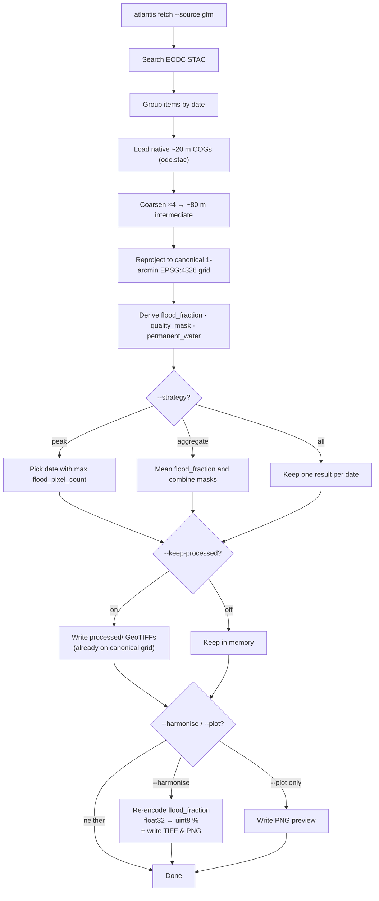

# GFM Pipeline Reference

Technical reference for Atlantis' GFM CLI, processing steps, output formats,
and configuration. For the user-facing introduction, quick start, and data
source overview, see [overview.md](overview.md).

## Decision flowchart



Because GFM processing already reprojects onto the canonical 1-arcmin grid,
the `processed/` outputs are spatially identical to harmonised outputs from
other sources. `--harmonise` therefore only re-encodes `flood_fraction` from
float32 [0,1] to uint8 [0,100] — no additional resampling occurs.

- **`--harmonise`** writes the re-encoded flood GeoTIFF plus a PNG preview.
  When both flags are passed, `--harmonise` subsumes `--plot`.
- **`--plot`** (without `--harmonise`) writes a PNG preview of the processed
  `flood_fraction` layer.
- **Neither** — only the `processed/` GeoTIFFs are written (unless
  `--no-keep-processed` is also set).

## Mode summary

| Strategy    | Best for                                    | Result shape                         |
| ----------- | ------------------------------------------- | ------------------------------------ |
| `peak`      | Single representative flood date            | One `FetchResult`                    |
| `aggregate` | Multi-item or multi-date coverage smoothing | One aggregated `FetchResult`         |
| `all`       | Time-series analysis                        | One `FetchResult` per surviving date |

| Flag combination      | Effect                                                                             |
| --------------------- | ---------------------------------------------------------------------------------- |
| `--no-keep-processed` | Skip the processed canonical-grid GeoTIFFs                                         |
| `--harmonise`         | Write the harmonised flood TIFF plus a harmonised PNG preview                      |
| `--plot`              | Without `--harmonise`, write a PNG preview of the processed `flood_fraction` layer |

## CLI reference

### `atlantis fetch --source gfm`

```bash
uv run atlantis fetch \
  --event <event_id> \
  --source gfm \
  --bbox "<west> <south> <east> <north>" \
  --start-date YYYY-MM-DD \
  --end-date YYYY-MM-DD \
  [flags]
```

### `atlantis harmonise --source gfm`

Re-run harmonisation on previously fetched GFM `processed/*_flood_fraction.tif`
outputs. For the standard GFM fetch path this is usually a same-grid re-encode,
because those processed outputs are already snapped to the canonical 1-arcmin
grid unless you override the harmoniser settings:

```bash
uv run atlantis harmonise \
  --event Valencia_2024 \
  --source gfm
```

## Flags

### Output control

| Flag                  | Default | Effect                                                                                                                                          |
| --------------------- | ------- | ----------------------------------------------------------------------------------------------------------------------------------------------- |
| `--harmonise`         | off     | Write a harmonised flood TIFF plus a harmonised PNG preview. At default settings this is a same-grid float32 → uint8 re-encode.                 |
| `--no-keep-processed` | off     | Skip the processed `flood_fraction` / mask GeoTIFFs and keep results in memory only unless you also request `--plot` or `--harmonise`           |
| `--plot`              | off     | Write a PNG preview of the processed `flood_fraction` layer when `--harmonise` is not requested                                                 |
| `--strategy`          | `peak`  | Multi-date reduction: `peak` (most-flooded date), `aggregate` (mean/mode composite), `all` (per-date outputs). Same default across all sources. |

### Processing

| Flag                   | Default   | Effect                                                                                                                                             |
| ---------------------- | --------- | -------------------------------------------------------------------------------------------------------------------------------------------------- |
| `--gfm-coarsen-factor` | `4`       | Spatial coarsening factor before reprojection. Reduces native ~20 m to ~80 m by default. Higher values trade resolution for speed/noise reduction. |
| `--gfm-resampling`     | `average` | Resampling method when reprojecting to EPSG:4326. Any rasterio method name is accepted.                                                            |

### Cross-source CLI flags ignored by GFM

| Flag            | Current GFM behavior                                                                 |
| --------------- | ------------------------------------------------------------------------------------ |
| `--no-classify` | Ignored. GFM always derives `flood_fraction`, `quality_mask`, and `permanent_water`. |
| `--no-stream`   | Ignored. GFM always streams source COGs via STAC / `odc.stac`.                       |

### Harmonisation

| Flag                  | Default | Effect                                      |
| --------------------- | ------- | ------------------------------------------- |
| `--target-resolution` | 0.0167° | Target grid spacing (1 arcmin default)      |
| `--dry-run`           |         | Show what would be processed without acting |

## Pipeline in detail

The GFM processing pipeline operates per-date and per-item. Each STAC item
corresponds to a single Sentinel-1 acquisition over one Sentinel-2 tile
footprint. Multiple items can cover the same date and bbox.

### Step-by-step

```text
STAC search → group by date → per-item loop → accumulate → classify → harmonise flood layer
                                    │
                    load (native CRS, ~20 m, odc.stac)
                    coarsen (max-pool × coarsen_factor)
                    compute binary masks (flood, perm, valid)
                    reproject to canonical 1-arcmin EPSG:4326
                    │
                (flood_count, perm_water_count, valid_count) ← accumulate
                    │
                    classify:
                        flood_fraction  = flood_count / valid_count    [0, 1], NaN where unobserved
                        quality_mask    = (valid_count > 0).uint8      {0, 1}
                        permanent_water = (perm_ratio > 0.5).uint8     {0, 1}
```

#### Why binary masks before reprojection?

`ensemble_flood_extent` has discrete codes (0 = dry, 1 = flood, 255 = nodata).
Applying `Resampling.average` directly on these codes would produce fractional
intermediates like 0.5 — which cannot be reliably thresholded back to 0 or 1.
Instead, Atlantis converts to a float32 binary mask _first_ (at the coarsened
native resolution where codes are still discrete), then reprojects with
`average` resampling. After reprojection each pixel contains the _fraction of
its area_ that was flooded — exactly what we want to accumulate across items.

#### Why max-pool for coarsening?

The max-pool preserves the flood signal: if any sub-pixel in the coarsened
neighbourhood is flooded (code 1), the coarsened result is 1. Alternatives
like mean would dilute the signal and risk rounding flood pixels to 0 before
the binary mask step.

#### Reprojection to the canonical grid

After computing the per-item binary masks in the native UTM CRS, Atlantis
reprojects each mask directly onto the **canonical 1-arcmin global EPSG:4326
grid** — the same grid used by ECMWF's `Globe_flood_area_*.grb` and VIIRS
harmonised outputs. This means:

- The bbox is snapped outward to the nearest cell edge of the global grid.
- Every output pixel centre satisfies `(lon + 180) × 60 − 0.5 ∈ ℤ` and
  `(90 − lat) × 60 − 0.5 ∈ ℤ`.
- GFM and VIIRS harmonised outputs over the same AOI are **stackable** without
  any further resampling.

See [Canonical 1-arcmin global grid](../viirs/overview.md#canonical-1-arcmin-global-grid)
for the full alignment specification.

## Strategies in detail

### `peak` — single most-flooded date

Implemented in [`atlantis.fetchers.gfm.selection.flood_pixel_count`](../../src/atlantis/fetchers/gfm/selection.py).

For each date `d`, count the flooded pixels:

$$
\text{flood\_count}_d = \sum_{(i,j)} \mathbb{1}\!\left[\text{flood\_fraction}_d(i,j) > 0\right]
$$

(NaN pixels — where no valid observation exists — are excluded from the count.)

Pick:

$$
d^{\star} = \arg\max_d \text{flood\_count}_d
$$

Ties go to the **earliest** date (first to reach the max during iteration).
The output filename carries only the single winning date token, e.g.
`Valencia_2024_20241031_gfm_harmonised.tif`.

### `aggregate` — temporal composite

All dates are stacked and reduced element-wise:

| Layer             | Reduction                                   | Rationale                             |
| :---------------- | :------------------------------------------ | :------------------------------------ |
| `flood_fraction`  | `np.nanmean(stack, axis=0)`                 | Continuous variable → arithmetic mean |
| `quality_mask`    | `np.any(stack > 0, axis=0)`                 | 1 if any date had valid data          |
| `permanent_water` | majority vote (`mean(stack, axis=0) > 0.5`) | Most-frequent value across dates      |
| `cloud_fraction`  | scalar `1 − valid_pixels/total_pixels`      | Tile-level metadata                   |

`nanmean` means pixels that were unobserved (NaN) on some dates are averaged
over the dates that _did_ observe them — no bias toward missing data.

The output `date_token` spans the full range:
`{first_date}_{last_date}`, e.g. `20241030_20241101`. For a single date the
token is just `20241030`.

### `all` — every date independently

No reduction. Each date's processed tile becomes a separate `FetchResult` with
its own date token. When `--harmonise` is set, each date produces its own
harmonised GeoTIFF + PNG.

## Output structure

```
<output>/
  <event_id>/
    gfm/
      processed/    # absent with --no-keep-processed
        <event_id>_<YYYYMMDD>_gfm_flood_fraction.tif    # float32, nodata=-9999
        <event_id>_<YYYYMMDD>_gfm_quality_mask.tif      # uint8, nodata=255
        <event_id>_<YYYYMMDD>_gfm_permanent_water.tif   # uint8, nodata=255
      plots/        # with --plot
        <event_id>_<date_token>_gfm.png
        <event_id>_<date_token>_gfm_harmonised.png      # with --harmonise
      harmonised/   # with --harmonise
        <event_id>_<date_token>_gfm_harmonised.tif
```

## Output format

### Processed outputs (canonical 1-arcmin grid)

| File                    | Dtype   | Nodata  | Values                                         |
| ----------------------- | ------- | ------- | ---------------------------------------------- |
| `*_flood_fraction.tif`  | float32 | -9999.0 | [0, 1] — fraction of obs flooded; NaN → nodata |
| `*_quality_mask.tif`    | uint8   | 255     | 1 = valid observation, 0 = no data             |
| `*_permanent_water.tif` | uint8   | 255     | 1 = permanent water, 0 = not                   |

- **CRS**: EPSG:4326 (WGS84)
- **Resolution**: canonical 1/60° grid (same grid as harmonised output)
- **Compression**: LZW

The native ~20 m rasters and the coarsened ~80 m intermediate arrays are not
written to disk by Atlantis' public GFM fetch path.

### Harmonised output (1 arcmin)

| Property        | Value                                                  |
| --------------- | ------------------------------------------------------ |
| **CRS**         | EPSG:4326 (WGS84)                                      |
| **Dtype**       | uint8                                                  |
| **Nodata**      | 255                                                    |
| **Values**      | 0–100 (flood fraction as integer percentage)           |
| **Resolution**  | 1/60° ≈ 1.85 km at the equator                         |
| **Grid**        | Canonical global grid, pixel centres at `±(k+0.5)/60°` |
| **Compression** | LZW                                                    |

Harmonised flood extent values are stored as **integer percentages** (0–100),
where 0 = no flood and 100 = fully flooded (same encoding as VIIRS harmonised
outputs). This gives 1% precision while using 4× less disk space than float32.

Only the harmonised `flood_fraction` layer is written to the GeoTIFF. The
side masks (`quality_mask`, `permanent_water`) remain part of the in-memory
dataset unless you keep the processed outputs.

Compatible with `rioxarray`, `rasterio`, QGIS, and any GDAL-based tool.

Override the API endpoint via `ATLANTIS_GFM_API_URL` or programmatically
through `FetcherConfig`.

## Configuration reference

| Config field          | Env var                        | Default   | Meaning                                               |
| --------------------- | ------------------------------ | --------- | ----------------------------------------------------- |
| `gfm_api_url`         | `ATLANTIS_GFM_API_URL`         | EODC URL  | STAC API endpoint                                     |
| `gfm_coarsen_factor`  | `ATLANTIS_GFM_COARSEN_FACTOR`  | `4`       | Spatial coarsening factor applied before reprojection |
| `gfm_resampling`      | `ATLANTIS_GFM_RESAMPLING`      | `average` | Resampling method for reprojection to EPSG:4326       |
| `target_resolution`   | `ATLANTIS_TARGET_RESOLUTION`   | `1/60`    | Harmonised output resolution in degrees               |
| `snap_to_global_grid` | `ATLANTIS_SNAP_TO_GLOBAL_GRID` | `True`    | Align harmonised output to canonical global grid      |

All config fields can also be set in a `.env` file at the repository root.

## Further reading

- [GFM overview](overview.md)
- [Python API](api.md)
- [Architecture and internals](internals.md)
- [Canonical 1-arcmin global grid](../viirs/overview.md#canonical-1-arcmin-global-grid) — alignment details shared with VIIRS
- [Pipeline vision](../../src/README.md)
- [EODC STAC API](https://stac.eodc.eu/api/v1)
- [End-to-end tests](../../tests/fetchers/test_gfm_e2e.py)
