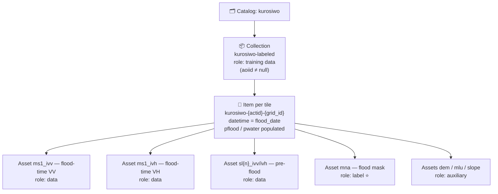

```mermaid
graph TD
    ROOT["🗂 Catalog: kurosiwo"]

    ROOT --> LC["📦 Collection\nkurosiwo-labeled\nrole: training data\n(aoiid ≠ null)"]

    LC --> LE["📄 Item per tile\nkurosiwo-{actid}-{grid_id}\ndatetime = flood_date\npflood / pwater populated"]

    LE --> LA1["Asset ms1_ivv — flood-time VV\nrole: data"]
    LE --> LA2["Asset ms1_ivh — flood-time VH\nrole: data"]
    LE --> LA3["Asset sl{n}_ivv/ivh — pre-flood\nrole: data"]
    LE --> LA4["Asset mna — flood mask\nrole: label ⭐"]
    LE --> LA5["Assets dem / mlu / slope\nrole: auxiliary"]
```
