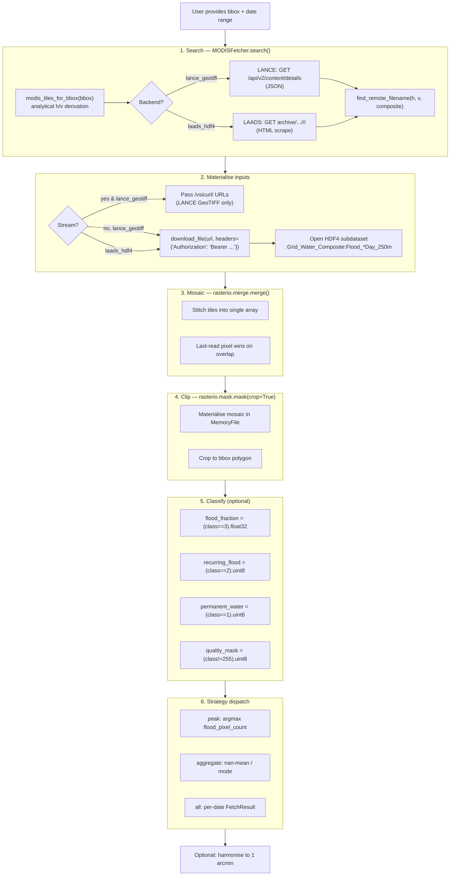

# MODIS Internals

Developer-facing documentation for the MODIS MCDWD fetcher architecture
and processing pipeline. For usage, see [modis.md](modis.md) and
[modis_api.md](modis_api.md).

## Architecture

```
┌─────────────────────────────────────────────────────────────┐
│                       MODISFetcher                          │
│                  (orchestrates the flow)                    │
└──────────┬───────────────────────┬──────────────────────────┘
           │                       │
           ▼                       ▼
┌──────────────────────┐   ┌────────────────────────┐
│   Backend Layer      │   │  ModisRasterProcessor  │
│                      │   │                        │
│ • LanceGeotiffBackend│   │ • Open HDF4 subdataset │
│   (streamable JSON)  │   │   (LAADS only)         │
│ • LaadsHdf4Backend   │   │ • Mosaic tiles         │
│   (HTML scrape DL)   │   │ • Clip to AOI          │
│                      │   │ • Classify pixels      │
│ Handles:             │   │ • Aggregate / write    │
│ • URL building       │   │                        │
│ • JSON / HTML listing│   │                        │
│ • Filename matching  │   │                        │
│ • Earthdata bearer   │   │                        │
└──────────────────────┘   └────────────────────────┘
```

The package layout mirrors `atlantis.fetchers.viirs/`:

| Module         | Responsibility                                  |
| -------------- | ----------------------------------------------- |
| `__init__.py`  | `MODISFetcher`, registered as `"modis"`         |
| `backend.py`   | `LanceGeotiffBackend`, `LaadsHdf4Backend`, auth |
| `processor.py` | Tile-grid maths, HDF4 extraction, mosaic+clip   |
| `selection.py` | Peak-date selectors (count + cloud-aware score) |
| `dataset.py`   | `ProcessedTile → xarray.Dataset` conversion     |

## End-to-end flow



## Auth and streaming

MCDWD on both backends requires an **Earthdata Login bearer token**.
There is no anonymous-read S3 mirror.

The fetcher injects the token in two complementary places:

1. **`requests.get(headers=...)`** for HTML / JSON listings and HDF4
   downloads. The optional `headers=` keyword on
   [`atlantis.utils.io.download_file`](../src/atlantis/utils/io.py)
   forwards it to `requests`.
2. **`rasterio.Env(GDAL_HTTP_HEADERS="Authorization: Bearer …")`**
   for `/vsicurl/` streaming. Scoped to the per-date processing block in
   `MODISFetcher.fetch()` so it never leaks to the rest of the process.

`stream=True` only works with `lance_geotiff` — HDF4 lacks an internal
chunked layout suitable for HTTP range reads. The constructor raises
`ValueError` if you mix `stream=True` with `laads_hdf4`.

## Tile grid (analytical)

MCDWD uses the standard MODLAND linear lat/lon grid. We compute the
tile coverage for an AOI bbox analytically — there is no packaged
`*.geojson` like VIIRS' AOI grid:

```python
def modis_tiles_for_bbox(bbox: tuple[float, float, float, float]) -> list[tuple[int, int]]:
    west, south, east, north = bbox
    h_min = floor((west + 180) / 10);  h_max = floor((east + 180) / 10)
    v_min = floor((90 - north) / 10);  v_max = floor((90 - south) / 10)
    return [(h, v) for h in range(h_min, h_max + 1) for v in range(v_min, v_max + 1)]
```

Tile bounds are reconstructed from `(h, v)` whenever needed (used by
`SearchResult.bbox`, by the HDF4 affine fallback, and by the unit
tests).

## HDF4 extraction (LAADS path)

MCDWD HDF4 files contain 15 subdatasets in a single `Grid_Water_Composite`
group (per User Guide Rev F, Dec 2025): four flood layers + 11 count
layers. The fetcher consumes only the four flood layers. Two practical
notes:

1. **Discovery via `rasterio.open(hdf).subdatasets`.** No subprocess
   `gdalinfo` is needed. We match by the `:Flood_{F1|FloodCS|F2|F3}_…_250m`
   suffix.
2. **Defensive affine fallback.** Modern GDAL builds parse the HDF-EOS
   Grid metadata correctly and return the affine via `src.transform`.
   When that fails (older builds), we synthesise it from the `(h, v)`
   token in the filename via `rasterio.transform.from_bounds(...)`.

The processor opens each HDF4 subdataset URI directly — they slot into
the same `rasterio.merge.merge()` call as the LANCE GeoTIFF inputs.

## Pixel classification

The decoder mirrors the layer mapping in [modis.md](modis.md#suggested-layer-mapping):

| Variable          | Rule                   | Meaning                                                                                                |
| ----------------- | ---------------------- | ------------------------------------------------------------------------------------------------------ |
| `flood_fraction`  | `(class == 3).float32` | Binary unusual-flood mask. Aggregates to true % at 1 arcmin via the harmoniser's `average` resampling. |
| `recurring_flood` | `(class == 2).uint8`   | MODIS-only seasonal-flood mask (Release 1.1+).                                                         |
| `permanent_water` | `(class == 1).uint8`   | Surface water from the rolling 5-year MOD44W mask.                                                     |
| `quality_mask`    | `(class != 255).uint8` | 1 = valid clear-sky observation; 0 = insufficient data **or HAND-masked**.                             |

Counts layers (`TotalCounts_*`, `ValidCounts*`, `WaterCounts*`) are
ignored in v1 but available via `rasterio.open(hdf).subdatasets` for
custom downstream pipelines.

## Aggregation

`ModisRasterProcessor.aggregate_tiles()` reduces an `(N, H, W)` time stack:

| Layer             | Reduction                   |
| ----------------- | --------------------------- |
| `flood_fraction`  | `np.nanmean(stack, axis=0)` |
| `quality_mask`    | per-pixel mode (uint8)      |
| `permanent_water` | per-pixel mode (uint8)      |
| `recurring_flood` | per-pixel mode (uint8)      |
| `raw`             | per-pixel mode (uint8)      |
| `cloud_fraction`  | scalar `np.mean`            |

Mode is computed via `scipy.stats.mode` when available, with a manual
`np.bincount` fallback. Ties are broken by the lowest pixel value
(matches the VIIRS implementation).

## Search diagnostics

`MODISFetcher.last_diagnostics` exposes a `ModisSearchDiagnostics`
record after every search. The CLI translates it into actionable hints
in `_report_empty_modis_fetch()`:

| Diagnostic flag             | Set when                                            | CLI hint                                      |
| --------------------------- | --------------------------------------------------- | --------------------------------------------- |
| `auth_token_missing`        | `EARTHDATA_TOKEN` is unset                          | "register at urs.earthdata.nasa.gov / export" |
| `tile_count == 0`           | bbox maps to zero MODIS tiles (often dateline)      | "split bbox at ±180°"                         |
| `outside_lance_window`      | LANCE returned empty for date(s) older than ~1 week | "switch to --modis-backend laads_hdf4"        |
| `year_coverage_gap`         | Every requested year is unpublished by the backend  | shows the published year set                  |
| `network_unreachable`       | All listing requests failed at the network layer    | suggests retry or backend swap                |
| `listings_all_empty`        | Listings reachable but empty                        | suggests widening the date window             |
| `no_tile_match_in_listings` | Listings have entries but none match required tiles | suggests widening / different composite       |

## Edge cases

| Scenario                             | Behaviour                                                                                                                                            |
| ------------------------------------ | ---------------------------------------------------------------------------------------------------------------------------------------------------- |
| Single tile bbox                     | `merge()` is a no-op on one tile; `mask()` crops it.                                                                                                 |
| Multi-tile bbox                      | `merge()` stitches; overlap pixels: last-read wins.                                                                                                  |
| `lance_geotiff` for old date         | `_is_within_lance_window()` skips it; diagnostic flags `outside_lance_window`.                                                                       |
| `laads_hdf4` HDF4 driver missing     | Constructor raises with a `conda install libgdal-hdf4` hint.                                                                                         |
| Token expired (401 from listing)     | Surfaces as a `network_unreachable` diagnostic.                                                                                                      |
| In-place NRT update during run       | Each per-date pass re-fetches the listing; if the prod-timestamp changed, the file is re-downloaded (cache key) — but v1 simply overwrites on rerun. |
| Pre-Release-1.1 archive (no class 2) | `recurring_flood` array is all zeros; `flood_fraction` matches event-driven flood as expected.                                                       |
