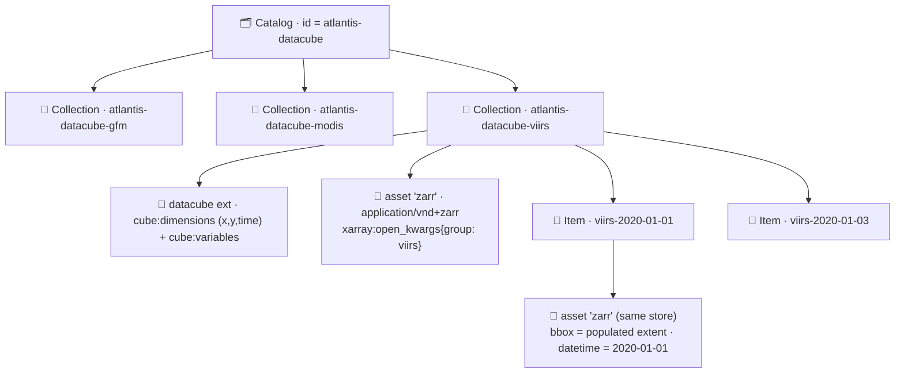
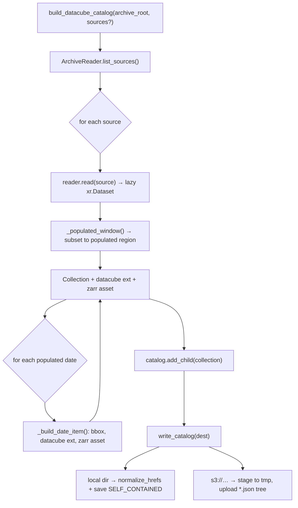
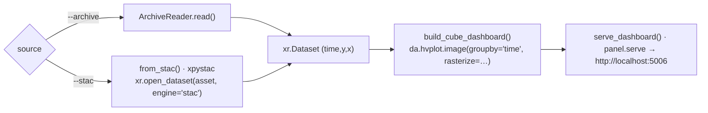

# Atlantis STAC + Visualization Layer — Implementation Spec

> Companion to the [Zarr datacube spec](./archive/zarr-spec.md). This document
> describes the **STAC discovery layer** built over the consolidated
> `datacube.zarr`, plus the **local visualization** (hvplot / Panel) demo that
> renders the cube with a time slider.
>
> Mental model:
>
> > **STAC = "what to load"** (catalog / metadata / query layer)
> > **Zarr = "how to load efficiently"** (chunked, cloud-native data layer)

**Source of truth**

| Concern                                   | Module                                                                              |
| ----------------------------------------- | ----------------------------------------------------------------------------------- |
| STAC catalog builder                      | [`src/atlantis/stac/datacube_catalog.py`](../src/atlantis/stac/datacube_catalog.py) |
| stac-geoparquet index                     | [`src/atlantis/stac/geoparquet.py`](../src/atlantis/stac/geoparquet.py)             |
| Visualization (hvplot/Panel)              | [`src/atlantis/viz/dashboard.py`](../src/atlantis/viz/dashboard.py)                 |
| Config (`StacConfig`, `VizConfig`)        | [`src/atlantis/config.py`](../src/atlantis/config.py)                               |
| CLI (`atlantis stac …`, `atlantis viz …`) | [`src/atlantis/cli.py`](../src/atlantis/cli.py)                                     |
| Underlying cube (reader, grid, store)     | [`src/atlantis/archive/`](../src/atlantis/archive)                                  |

> This is **separate** from the KuroSiwo SAR STAC catalog
> ([`stac_catalog.py`](../src/atlantis/stac/stac_catalog.py)), which indexes
> GeoTIFF assets on S3. The datacube catalog described here indexes the **Zarr
> datacube**.

---

## 1. Overview

The consolidated archive is a single sharded **Zarr v3** store (`datacube.zarr`)
with **one group per source** (`gfm`, `modis`, `viirs`, …) on a shared global
1-arcmin grid (see the [Zarr spec](./archive/zarr-spec.md)). The STAC layer sits
_on top_ of that store as a lightweight, serverless **discovery index**.

We adopt **Option A** (one Zarr store, many STAC Items), adapted to the
multi-group cube:

- **one Collection per source group**, and
- **one Item per populated date**.

Every Collection and Item references the _same_ Zarr store as an **asset**;
selection still happens in xarray (`.sel(time=…)`, bbox windowing). STAC filters
metadata only — it never reads inside the Zarr.



---

## 2. Design decisions

| Decision            | Choice                                                             | Why                                                                                                                                          |
| ------------------- | ------------------------------------------------------------------ | -------------------------------------------------------------------------------------------------------------------------------------------- |
| Catalog granularity | Collection per source + Item per date                              | The cube is multi-group and sparse/event-driven, so per-source + per-date discovery is meaningful (Option A from the original design notes). |
| Item ↔ Zarr mapping | One shared asset; client slices by `datetime`                      | Avoids one-Zarr-per-day sprawl; matches xarray's native `time` slicing.                                                                      |
| Extensions          | datacube + xarray-assets                                           | Express dimensions/variables and make the asset directly openable as xarray.                                                                 |
| Catalog backing     | **Static** JSON tree (local → S3) + **stac-geoparquet** scale path | Serverless, S3-native, reuses the existing static-catalog pattern; no API server/DB to run.                                                  |
| Item bbox           | Populated (non-fill) extent per date                               | The sparse global grid would otherwise yield meaningless global bboxes.                                                                      |

> **Not** chosen (kept for the roadmap — see §16): a dynamic `stac-fastapi` +
> pgstac API, and tile services (TiTiler / xcube / xpublish). These are the
> production-scale options; they are unnecessary for the current static,
> serverless demo.

---

## 3. Catalog structure & identifiers

| Object     | `id` pattern            | Example                   | `datetime`               |
| ---------- | ----------------------- | ------------------------- | ------------------------ |
| Catalog    | `StacConfig.catalog_id` | `atlantis-datacube`       | —                        |
| Collection | `{catalog_id}-{source}` | `atlantis-datacube-viirs` | extent only              |
| Item       | `{source}-{YYYY-MM-DD}` | `viirs-2020-01-01`        | UTC midnight of the date |

On disk a written catalog is a self-contained JSON tree:

```text
<output>/
├── catalog.json
├── atlantis-datacube-viirs/
│   ├── collection.json
│   ├── viirs-2020-01-01/viirs-2020-01-01.json
│   └── viirs-2020-01-03/viirs-2020-01-03.json
└── atlantis-datacube-modis/
    ├── collection.json
    └── modis-2020-01-02/modis-2020-01-02.json
```

---

## 4. STAC extensions

### 4.1 datacube — `v2.2.0`

Applied to both Collections and Items (`cube:dimensions` + `cube:variables`).
Collection-level fields live in the collection body; item-level fields live in
`item.properties`.

| `cube:dimension` | type             | extent               | step    | notes                    |
| ---------------- | ---------------- | -------------------- | ------- | ------------------------ |
| `x`              | spatial (axis x) | `[west, east]`       | `+1/60` | `reference_system: 4326` |
| `y`              | spatial (axis y) | `[south, north]`     | `-1/60` | north→south              |
| `time`           | temporal         | `[start, end]` (ISO) | —       | per-item: a single day   |

`cube:variables` mirror the cube's data variables (`flood_fraction`,
`quality_mask`, `permanent_water`, `+ recurring_flood` for MODIS), each with
`dimensions: [time, y, x]`, `type: data`; `flood_fraction` carries `unit: "1"`.

### 4.2 xarray-assets — `v1.0.0`

Attached to the `zarr` asset so a client can open it directly as xarray:

- `xarray:open_kwargs` — `{engine, group, consolidated, decode_coords}`
- `xarray:storage_options` — fsspec options, **only** for remote (`s3://`) roots.

---

## 5. The Zarr asset

Each Collection and Item exposes a single `zarr` asset pointing at the shared
store. The Item describes a _time slice_ of that store; the client opens the
group and selects the item's `datetime`.

```json
"assets": {
  "zarr": {
    "href": "s3://atlantis/zarr/datacube.zarr",
    "type": "application/vnd+zarr",
    "roles": ["data"],
    "title": "viirs flood datacube (Zarr)",
    "xarray:open_kwargs": {
      "engine": "zarr",
      "group": "viirs",
      "consolidated": true,
      "decode_coords": "all"
    }
  }
}
```

`href` resolution ([`_store_href`](../src/atlantis/stac/datacube_catalog.py)):
an absolute local path for filesystem roots, or `…/datacube.zarr` for `s3://`
roots. Asset hrefs stay absolute even in a self-contained catalog (only the
catalog/collection/item links are relativised).

---

## 6. Populated-extent computation

For a sparse global cube, a per-date global bbox would be meaningless, so item
bboxes are derived from the data:

1. **Per source, once** — reduce `flood_fraction` to a `(y, x)` validity mask
   (`notnull().any("time")`) and take its bounding index window
   ([`_populated_window`](../src/atlantis/stac/datacube_catalog.py)). The cube is
   subset to this window so the next step stays cheap.
2. **Per date** — within that window, compute the bounding box of non-fill
   pixels for the day ([`_bbox_from_mask`](../src/atlantis/stac/datacube_catalog.py)),
   mapping pixel centres ± ½-resolution to edges.
3. **Fallback** — the global bbox `[-180, -90, 180, 90]` when a date is empty or
   when `StacConfig.compute_item_bbox = False`.

> Setting `compute_item_bbox = False` (CLI `--no-compute-bbox`) skips the scan
> entirely and gives every item the source extent — faster, coarser discovery.

---

## 7. Build & write data-flow



---

## 8. Catalog backing & the scale path

| Backing                 | What it is                               | Use when                                                    |
| ----------------------- | ---------------------------------------- | ----------------------------------------------------------- |
| **Static JSON (local)** | self-contained tree on disk              | demo / development                                          |
| **Static JSON (S3)**    | same tree uploaded beside the Zarr store | sharing, serverless reads                                   |
| **stac-geoparquet**     | one columnar Parquet of all items        | fast bbox/datetime search over many items, still serverless |
| `stac-fastapi` (future) | hosted API + Postgres/pgstac             | external consumers, very large catalogs (§16)               |

The **stac-geoparquet** index ([`geoparquet.py`](../src/atlantis/stac/geoparquet.py))
is the serverless scale path: query thousands of items with geopandas/DuckDB
(bbox + datetime predicates) without standing up a server.

---

## 9. CLI

```text
atlantis stac build              Build the catalog from the datacube and write it
atlantis stac validate           Validate a catalog (structure + JSON schema)
atlantis stac export-geoparquet  Export all items to a stac-geoparquet index
```

| `stac build` flag   | Default                      | Meaning                                                    |
| ------------------- | ---------------------------- | ---------------------------------------------------------- |
| `--archive, -a`     | `ArchiveConfig.archive_root` | Datacube root (local dir or `s3://`)                       |
| `--output, -o`      | `StacConfig.catalog_root`    | Catalog destination (local dir or `s3://`)                 |
| `--source, -s`      | all present                  | Restrict to these source groups (repeatable)               |
| `--no-compute-bbox` | off                          | Use the source extent for every item (skip per-date scans) |

```bash
# Build a local catalog from a local cube
atlantis stac build --archive ./data/viirs_2020_cube --output ./data/stac

# Build straight onto S3 (next to the Zarr store)
atlantis stac build -a s3://atlantis/zarr -o s3://atlantis/stac/datacube

# Validate, then export a geoparquet index
atlantis stac validate ./data/stac
atlantis stac export-geoparquet ./data/stac --output ./data/stac/items.parquet
```

---

## 10. Python API

```python
from atlantis.stac import build_datacube_catalog, write_catalog

catalog = build_datacube_catalog("s3://atlantis/zarr")  # or a local path
write_catalog(catalog, "s3://atlantis/stac/datacube")  # local dir or s3://

# Serverless scale-path index
import pystac
from atlantis.stac.geoparquet import export_items_to_geoparquet, search_geoparquet

cat = pystac.Catalog.from_file("./data/stac/catalog.json")
export_items_to_geoparquet(cat.get_items(recursive=True), "items.parquet")

hits = search_geoparquet("items.parquet", bbox=(-1.5, 38.8, 0.5, 40.0), start="2024-10-29", end="2024-11-04")
```

---

## 11. `StacConfig`

[`StacConfig`](../src/atlantis/config.py) — env prefix `ATLANTIS_`.

| Field                 | Env var                        | Default                   |
| --------------------- | ------------------------------ | ------------------------- |
| `catalog_id`          | `ATLANTIS_CATALOG_ID`          | `atlantis-datacube`       |
| `catalog_title`       | `ATLANTIS_CATALOG_TITLE`       | `Atlantis flood datacube` |
| `catalog_description` | `ATLANTIS_CATALOG_DESCRIPTION` | (see source)              |
| `catalog_root`        | `ATLANTIS_CATALOG_ROOT`        | `~/atlantis-data/stac`    |
| `zarr_media_type`     | `ATLANTIS_ZARR_MEDIA_TYPE`     | `application/vnd+zarr`    |
| `compute_item_bbox`   | `ATLANTIS_COMPUTE_ITEM_BBOX`   | `true`                    |

---

## Visualization (local HoloViz demo)

### 12. Overview

A local **hvplot + Panel** dashboard renders a datacube variable as an
interactive map with a **time slider**, optionally rasterised server-side with
**datashader** and overlaid with coastlines & country borders — plus an optional
web-tile basemap — via **geoviews**. This is the
"start simple" demo path; tile servers (TiTiler / xcube) are deferred (§16).



Plotting dependencies are imported **lazily**, so importing `atlantis.viz` never
requires the `viz` extra — only calling the build/serve functions does. If
`datashader` or `geoviews` are absent, rasterisation / basemap degrade
gracefully (a warning is logged and rendering continues).

---

### 13. Python API

[`src/atlantis/viz/dashboard.py`](../src/atlantis/viz/dashboard.py)

| Function                        | Purpose                                                 |
| ------------------------------- | ------------------------------------------------------- |
| `load_dataset(source, …)`       | Read a windowed Dataset directly (archive) or via STAC  |
| `build_cube_dashboard(…)`       | Build the hvplot image (time slider) → HoloViews object |
| `serve_dashboard(…)`            | Build + serve on a local Panel server (blocking)        |
| `from_stac(catalog, source, …)` | Open the catalog's `zarr` asset as xarray (xpystac)     |

```python
from atlantis.viz import build_cube_dashboard, serve_dashboard, from_stac

# Direct from the datacube
serve_dashboard(
    "viirs", archive_root="./data/viirs_2020_cube", bbox=(-1.5, 38.8, 0.5, 40.0), start="2024-10-29", end="2024-11-04"
)

# Discover through STAC, then render
ds = from_stac("./data/stac", "viirs")
dashboard = build_cube_dashboard(ds=ds, var="flood_fraction")
```

`from_stac` resolves the source's Collection, then opens its `zarr` asset with
`xarray.open_dataset(asset, engine="stac")` (the engine is registered by
`xpystac`), applying the same bbox/time windowing as the direct reader.

---

### 14. CLI

```text
atlantis viz serve SOURCE        Serve an interactive dashboard (time slider)
```

| Flag               | Default                      | Meaning                                                              |
| ------------------ | ---------------------------- | -------------------------------------------------------------------- |
| `SOURCE`           | (required)                   | Source group, e.g. `viirs`                                           |
| `--archive, -a`    | `ArchiveConfig.archive_root` | Datacube root (local dir or `s3://`)                                 |
| `--stac`           | —                            | Discover via a STAC catalog root instead of the archive              |
| `--var`            | `VizConfig.variable`         | Variable to render                                                   |
| `--bbox`           | —                            | AOI `"west south east north"` (degrees)                              |
| `--start`, `--end` | —                            | Inclusive date range (`YYYY-MM-DD`)                                  |
| `--basemap`        | off                          | Overlay coastlines & country borders (requires `geoviews`/`cartopy`) |
| `--tiles`          | off                          | Add an OSM web-tile basemap under the data (requires `geoviews`)     |
| `--port`, `--host` | `5006`, `localhost`          | Server bind address                                                  |
| `--no-show`        | off                          | Do not auto-open a browser tab                                       |

```bash
# Serve the Valencia window from the local cube
atlantis viz serve viirs -a ./data/viirs_2020_cube \
  --bbox "-1.5 38.8 0.5 40.0" --start 2024-10-29 --end 2024-11-04

# Serve via STAC discovery
atlantis viz serve viirs --stac ./data/stac
```

---

### 15. `VizConfig`

[`VizConfig`](../src/atlantis/config.py) — env prefix `ATLANTIS_`.

| Field         | Env var                | Default          |
| ------------- | ---------------------- | ---------------- |
| `variable`    | `ATLANTIS_VARIABLE`    | `flood_fraction` |
| `cmap`        | `ATLANTIS_CMAP`        | `Blues`          |
| `host`        | `ATLANTIS_HOST`        | `localhost`      |
| `port`        | `ATLANTIS_PORT`        | `5006`           |
| `basemap`     | `ATLANTIS_BASEMAP`     | `false`          |
| `tiles`       | `ATLANTIS_TILES`       | `false`          |
| `rasterize`   | `ATLANTIS_RASTERIZE`   | `true`           |
| `frame_width` | `ATLANTIS_FRAME_WIDTH` | `700`            |

---

### 16. Dependencies & installation

Both features are optional extras (declared in
[`pyproject.toml`](../pyproject.toml) and [`pixi.toml`](../pixi.toml)).

| Extra  | Packages                                                                            |
| ------ | ----------------------------------------------------------------------------------- |
| `stac` | `atlantis[geo]` + `stac-geoparquet`, `xpystac`                                      |
| `viz`  | `atlantis[geo]` + `hvplot`, `holoviews`, `panel`, `datashader`, `geoviews`, `bokeh` |

```bash
# uv / pip
pip install -e ".[stac,viz]"

# pixi (dedicated environments)
pixi install -e stac
pixi install -e viz
pixi run -e viz atlantis viz serve viirs -a ./data/viirs_2020_cube
```

---

### 17. Out of scope (roadmap)

Captured from the original architecture exploration; deliberately **not** built
yet to keep the first iteration static and serverless:

- **Dynamic STAC API** — `stac-fastapi` + Postgres/pgstac for indexed
  `/search` at very large scale or for external consumers.
- **Tile services** — `TiTiler`, `xcube` server, or `xpublish` to serve Zarr/COG
  map tiles to a JS frontend (MapLibre / deck.gl).
- **COG derivation** — precompute COG tiles from the Zarr for ultra-fast web maps
  (the "hybrid" analysis-vs-visualisation pattern).
- **Archive-write hook** — auto-update the catalog on every `ArchiveWriter.write`
  (today the catalog is (re)built on demand via `atlantis stac build`).
