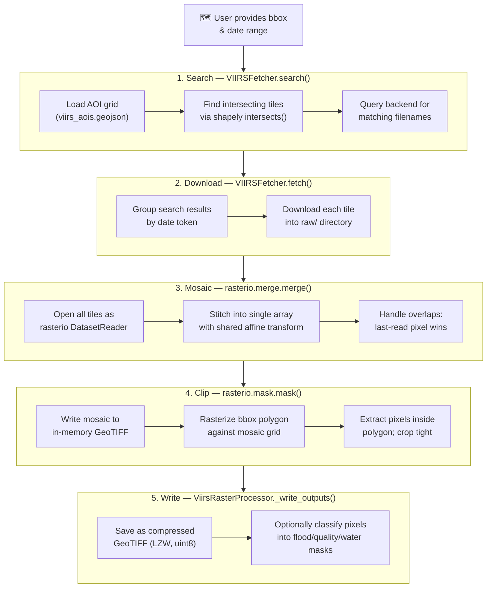

# VIIRS Flood Detection

**Satellite-based flood mapping at 375 m resolution**

Atlantis integrates VIIRS flood products from the JPSS (Joint Polar Satellite System) constellation—providing global flood detection from the VIIRS Flood Mapping (VFM) product ([NOAA ATBD v1.0, 2021](https://www.star.nesdis.noaa.gov/jpss/documents/ATBD/ATBD_VIIRS_Flood_Mapping_v1.0.pdf)).

## What is VIIRS?

VIIRS (Visible Infrared Imaging Radiometer Suite) instruments aboard Suomi-NPP
and NOAA-20 satellites detect floods at **375 metre resolution** using four
Imager bands: I1 (visible, 0.64 µm), I2 (near-IR, 0.865 µm), I3 (shortwave-IR,
1.61 µm), and I5 (thermal IR, 11.45 µm). The flood products encode integer pixel
codes:

### Pixel encoding

The GeoTIFFs on the NOAA S3 bucket use a simplified encoding (different from the [ATBD](https://www.star.nesdis.noaa.gov/jpss/documents/ATBD/ATBD_VIIRS_Flood_Mapping_v1.0.pdf)'s internal netCDF scheme). Land-type classes are omitted — only water, cloud, and flood appear:

| Code    | Meaning                                                                      |
| ------- | ---------------------------------------------------------------------------- |
| 1       | Fill / No data (nodata sentinel)                                             |
| 17      | Permanent water                                                              |
| 20      | Seasonal water                                                               |
| 30      | Cloud cover                                                                  |
| 99      | Open water                                                                   |
| 101–200 | **Flood water** — water fraction % = `code − 100`                            |
| ≥160    | **High-confidence flood** (≥60% water fraction — Atlantis default threshold) |

> **Note:** The ATBD netCDF format uses different codes (e.g. 16=bare land,
> 17=vegetation). The GeoTIFF distribution simplifies these — land pixels are
> omitted, and codes 17/20/99 carry water-related meanings instead.
> The full flood range is 101–200; Atlantis uses `FLOOD_MIN_CODE = 160`
> in `processor.py` as a conservative threshold, which can be adjusted if needed.

By default Atlantis writes the raw pixel values as-is. Pass `--classify` to derive three binary layers: flood extent, quality mask, and permanent water mask.

## Quick Start

### Fetch for any location and date range

```bash
uv run atlantis fetch \
  --event Valencia_2024 \
  --source viirs \
  --bbox "-1.0 39.0 0.0 40.0" \
  --start-date 2024-10-29 \
  --end-date 2024-10-29
```

Atlantis will:

1. **Search** VIIRS AOI tiles intersecting your bbox
2. **Download** raw GeoTIFFs from the NOAA JPSS S3 bucket (or stream them — see below)
3. **Mosaic** multiple tiles if the bbox spans more than one VIIRS tile
4. **Clip** the mosaic to your exact region
5. **Write** a single raw GeoTIFF:
   - `<event_id>_<date>_viirs_raw.tif` — integer pixel codes (0–255)

Add `--classify` to also write three derived layers:

```bash
uv run atlantis fetch \
  --event Valencia_2024 \
  --source viirs \
  --bbox "-1.0 39.0 0.0 40.0" \
  --start-date 2024-10-29 \
  --end-date 2024-10-29 \
  --classify
```

This produces:

- `*_flood_extent.tif` — binary flood mask (1 = flooded pixel)
- `*_quality_mask.tif` — 0 = cloud/fill, 1 = valid observation
- `*_permanent_water.tif` — permanent water bodies mask

#### Flood threshold

The ATBD GeoTIFF flood range is **101–200**, where the code encodes water
fraction (101 = 1 %, 200 = 100 %). By default Atlantis applies a conservative
threshold of **160** (≥60 % water fraction) to avoid false positives from
pixels with marginal water contamination.

| Flag                    | Range          | Effect                             |
| ----------------------- | -------------- | ---------------------------------- |
| `--flood-threshold 101` | Most inclusive | Captures all VIIRS flood pixels    |
| `--flood-threshold 160` | **Default**    | Conservative: ≥60 % water fraction |
| `--flood-threshold 180` | Most stringent | Only high-confidence flood (≥80 %) |

```bash
# Conservative (default)
uv run atlantis fetch ... --classify

# Catch marginal flooding — lower threshold
uv run atlantis fetch ... --classify --flood-threshold 101

# Only highest-confidence pixels
uv run atlantis fetch ... --classify --flood-threshold 180
```

Pixels **not** counted as flood at any threshold:
1, 17, 20, 30, 99 — fill, permanent/seasonal/open water, and cloud are always excluded.

The same flag works on `fetch-kurosiwo-viirs` and through the Python API
(`VIIRSFetcher(flood_min_code=101)`).

### Stream tiles (no download)

VIIRS tiles (~20 MB each) can be streamed directly from NOAA S3 via GDAL's
`/vsicurl/` driver instead of downloading them to disk. This is a big win
when storage is tight or you're processing many events, because no `raw/`
directory is ever created.

```bash
# Stream tiles: no local download, no raw/ cache
uv run atlantis fetch \
  --event Valencia_2024 \
  --source viirs \
  --bbox "-1.0 39.0 0.0 40.0" \
  --start-date 2024-10-29 \
  --end-date 2024-10-29 \
  --classify \
  --stream
```

| Mode      | Flag        | Disk per event (typical)  | Network dependency    |
| --------- | ----------- | ------------------------- | --------------------- |
| Download  | _(default)_ | ~50–200 MB raw tiles      | Only during fetch     |
| Streaming | `--stream`  | 0 (only processed output) | During processing too |

> **Note:** `--stream` works with the `noaa_s3` backend only (the default).
> Streaming is not yet supported for `gmu_legacy`.

### Resample to a uniform grid (harmonise)

After fetching, resample the VIIRS outputs to a common target resolution
(1 arcmin / 0.0167° by default) so they can be combined across sources:

```bash
uv run atlantis harmonise \
  --event Valencia_2024 \
  --source viirs
```

This runs the pipeline: **reproject → normalise → quality masks**. The
output is a single `float32` GeoTIFF with flood-fraction values in `[0, 1]`
at 1 arcmin resolution, plus a quality mask and a permanent-water mask.

```bash
# Custom target resolution (e.g. 5 arcmin)
uv run atlantis harmonise \
  --event Valencia_2024 \
  --source viirs \
  --target-resolution 0.08333

# Dry-run to see what would be processed
uv run atlantis harmonise \
  --event Valencia_2024 \
  --source viirs \
  --dry-run
```

> **Tip:** The harmoniser uses `average` resampling for flood extent (produces
> a flood‑fraction) and `mode` for binary masks (quality, permanent water).
> You can override these via `ATLANTIS_VARIABLE_RESAMPLING` in `.env`.

### Use the KuroSiwo catalogue

Fetch VIIRS for any event from the KuroSiwo SAR flood dataset:

```bash
# Directly from the GeoPackage catalogue
uv run atlantis fetch-kurosiwo-viirs \
  --catalogue assets/ks_catalogue.gpkg \
  --case KuroSiwo_470

# Pre-build metadata CSV for faster repeated runs
uv run atlantis build-kurosiwo-metadata \
  --catalogue assets/ks_catalogue.gpkg \
  --output data/metadata/kurosiwo_metadata_v1.csv

uv run atlantis fetch-kurosiwo-viirs \
  --metadata data/metadata/kurosiwo_metadata_v1.csv \
  --case KuroSiwo_470
```

Widen the temporal window around the flood peak with `--days-before` / `--days-after`:

```bash
uv run atlantis fetch-kurosiwo-viirs \
  --catalogue assets/ks_catalogue.gpkg \
  --case KuroSiwo_470 \
  --days-before 2 \
  --days-after 2
```

Add `--classify` for derived layers:

```bash
uv run atlantis fetch-kurosiwo-viirs \
  --catalogue assets/ks_catalogue.gpkg \
  --case KuroSiwo_470 \
  --classify
```

Add `--stream` to skip downloading raw tiles:

```bash
uv run atlantis fetch-kurosiwo-viirs \
  --catalogue assets/ks_catalogue.gpkg \
  --case KuroSiwo_470 \
  --classify \
  --stream
```

Fetch all events (optionally limited):

```bash
# All KuroSiwo events
uv run atlantis fetch-kurosiwo-viirs \
  --catalogue assets/ks_catalogue.gpkg \
  --output /path/to/output

# First 5 events only
uv run atlantis fetch-kurosiwo-viirs \
  --catalogue assets/ks_catalogue.gpkg \
  --limit 5
```

### Output structure

```
<output>/
  <case_id>/
    viirs/
      raw/          # downloaded source tiles from NOAA S3  (absent with --stream)
      processed/    # clipped, mosaicked GeoTIFF outputs
        <case_id>_<YYYYMMDD>_viirs_raw.tif
        # with --classify:
        <case_id>_<YYYYMMDD>_viirs_flood_extent.tif
        <case_id>_<YYYYMMDD>_viirs_quality_mask.tif
        <case_id>_<YYYYMMDD>_viirs_permanent_water.tif
      harmonised/   # with atlantis harmonise: 1-arcmin resampled tifs
        <case_id>_<YYYYMMDD>_viirs_harmonised.tif
```

## Backends

Two VIIRS data sources are supported:

| Backend      | Description                                                 | Default |
| ------------ | ----------------------------------------------------------- | ------- |
| `noaa_s3`    | NOAA JPSS public S3 bucket (`noaa-jpss`) — 1-day composites | ✅      |
| `gmu_legacy` | GMU legacy HTTP archive — 5-day composites                  |         |

Switch with `--viirs-backend`:

```bash
uv run atlantis fetch-kurosiwo-viirs \
  --catalogue assets/ks_catalogue.gpkg \
  --case KuroSiwo_470 \
  --viirs-backend gmu_legacy
```

Or set a default via environment variable:

```bash
export ATLANTIS_VIIRS_BACKEND=gmu_legacy
```

## Python API

```python
from pathlib import Path
from datetime import date

from atlantis.fetchers.viirs import VIIRSFetcher
from atlantis.models.event import FloodEvent

# ── Arbitrary event ───────────────────────────────────────────────────────────
event = FloodEvent(
    event_id="Valencia_2024",
    bbox=(-1.0, 39.0, 0.0, 40.0),   # west, south, east, north
    start_date=date(2024, 10, 29),
    end_date=date(2024, 10, 29),
)

fetcher = VIIRSFetcher()                     # raw mode (default)
fetch_results = fetcher.fetch(event, Path("data/viirs/Valencia_2024"))

# Load into xarray for analysis / plotting
ds = fetcher.to_dataset(fetch_results[0])
raw = ds["raw"]                              # xarray DataArray, CRS=EPSG:4326
print(raw.shape, raw.dtype)

# ── With classified outputs ───────────────────────────────────────────────────
fetcher_c = VIIRSFetcher(classify=True)
fetch_results_c = fetcher_c.fetch(event, Path("data/viirs/Valencia_2024_classified"))

ds_c = fetcher_c.to_dataset(fetch_results_c[0])
print(ds_c["flood_extent"].sum().item(), "flooded pixels")

# ── KuroSiwo event via metadata CSV ──────────────────────────────────────────
from atlantis.utils.kurosiwo import build_kurosiwo_flood_events

events = build_kurosiwo_flood_events(
    Path("data/metadata/kurosiwo_metadata_v1.csv"),
    case="KuroSiwo_470",
    days_before=1,
    days_after=1,
)
ks_results = fetcher.fetch(events[0], Path("data/viirs/KuroSiwo_470"))
ks_ds = fetcher.to_dataset(ks_results[0])

# ── Streaming mode (no local tiles) ──────────────────────────────────────────
fetcher_stream = VIIRSFetcher(stream=True, classify=True)
stream_results = fetcher_stream.fetch(event, Path("data/viirs/Valencia_2024"))
stream_ds = fetcher_stream.to_dataset(stream_results[0])

# ── Harmonise (resample + normalise) ─────────────────────────────────────────
from atlantis.harmoniser import Harmoniser

harmoniser = Harmoniser()  # defaults to 1 arcmin target
ds_harm = harmoniser.harmonise(ds_c, source_id="viirs")
print(ds_harm["flood_extent"].dtype, ds_harm["flood_extent"].shape)
# float32, ~6% of original pixels
```

### Display a fetched raster

```python
import matplotlib.pyplot as plt
from matplotlib.patches import Patch

viirs_codes = {
    1:   ("Fill / No data",   "#000000"),
    17:  ("Permanent water",  "#1f77b4"),
    20:  ("Seasonal water",   "#17becf"),
    30:  ("Cloud",            "#cccccc"),
    99:  ("Open water",       "#4682B4"),
    130: ("Flood (30% frac)", "#ffeb3b"),
    160: ("Flood (60% frac)", "#FF9800"),
    200: ("Flood (100%)",     "#FF0000"),
}

fig, (ax, ax_leg) = plt.subplots(1, 2, figsize=(14, 7),
                                  gridspec_kw={"width_ratios": [3, 1]})
raw.plot(ax=ax, cmap="turbo", add_colorbar=True)
ax.set_title("VIIRS raw composite (375 m)")

patches = [Patch(facecolor=c, label=f"{k}: {l}") for k, (l, c) in viirs_codes.items()]
ax_leg.legend(handles=patches, loc="center", title="Pixel codes")
ax_leg.axis("off")
plt.tight_layout()
plt.show()
```

## Architecture

```
┌─────────────────────────────────────────────────────────┐
│                    VIIRSFetcher                         │
│              (orchestrates the flow)                    │
└─────────────┬───────────────────────┬───────────────────┘
              │                       │
              ▼                       ▼
┌─────────────────────┐    ┌──────────────────────┐
│   Backend Layer     │    │  ViirsRasterProcessor │
│                     │    │                      │
│ • NoaaS3Backend     │    │ • Mosaic tiles       │
│ • GmuLegacyBackend  │    │ • Clip to AOI        │
│                     │    │ • Classify pixels    │
│ Handles:            │    │ • Write GeoTIFFs     │
│ • URL building      │    │                      │
│ • Directory listing │    │                      │
│ • Filename matching │    │                      │
└─────────────────────┘    └──────────────────────┘
```

## Processing Pipeline

When you run `atlantis fetch --source viirs`, the system executes a five-stage pipeline.
Stages 3 (Mosaic) and 4 (Clip) are the core raster operations; they're implemented
in `ViirsRasterProcessor._mosaic_and_clip()` inside `src/atlantis/fetchers/viirs/processor.py`.

### End-to-end flow



### Stage 3 — Mosaic (handling multiple tiles)

VIIRS flood products are pre-tiled into ~10°×10° grid cells called **AOIs** (Areas of Interest).
If your bounding box straddles a tile boundary, `search()` will return multiple tiles for the same date.
These must be merged before clipping.

#### How `rasterio.merge.merge()` works

`merge()` takes a list of opened `DatasetReader` objects and produces:

| Output      | Description                                                                       |
| ----------- | --------------------------------------------------------------------------------- |
| `mosaic`    | A 3D numpy array `(bands, rows, cols)` spanning the union extent of all inputs    |
| `transform` | A single `Affine` mapping pixel coordinates to geographic coordinates (EPSG:4326) |

Under the hood it:

1. Computes the **union bounding box** — the smallest rectangle that contains every input tile
2. Creates an **output grid** at the native resolution (375 m), big enough to hold the union
3. Copies each input tile's pixels into the correct position within the output grid
4. Where tiles overlap, the **last-read tile's pixels win** (rasterio's default `method='last'`)

#### Overlap resolution

VIIRS AOI tiles intentionally overlap by a small margin along their edges — this is the
NOAA product design, not a bug. `merge()`'s default `method='last'` is appropriate here
because all tiles are from the same sensor at the same resolution; there is no quality
difference across the overlap zone. The pixels in the seam are identical regardless of
which tile "wins."

```
   Tile GLB023                    Tile GLB024
  ┌──────────────┐              ┌──────────────┐
  │              │              │              │
  │    ░░░░░░    │              │    ░░░░░░    │
  │    ░░░░░░    │              │    ░░░░░░    │
  │    ░░░░░░    │              │    ░░░░░░    │
  └──────────────┘              └──────────────┘
         │                            │
         └────────── merge() ─────────┘
                      │
                      ▼
             ┌────────────────────┐
             │     ░░░░░░░░░░     │
             │     ░░░░░░░░░░     │  ← overlap zone:
             │     ░░░░░░░░░░     │    GLB024 pixels win
             └────────────────────┘
```

For alternative overlap strategies — e.g. averaging, taking the max, or ordering by
acquisition time — you could pass `method='max'` or `method='first'` to `merge()`.

#### Single-tile shortcut

If only one tile matches your bbox, `merge()` still works — it simply returns that tile
unchanged (wrapped in a single-element mosaic). No special-casing is needed.

### Stage 4 — Clip (trimming to your bbox)

After mosaicing, the raster covers **all** matching AOI tiles — which is always larger
than your requested bbox (unless you happen to request exactly one tile's extent).
The clip step trims it down.

#### How `rasterio.mask.mask()` works

`mask()` takes a raster dataset and one or more Shapely geometries, and returns:

| Output              | Description                                                                       |
| ------------------- | --------------------------------------------------------------------------------- |
| `clipped`           | A 3D numpy array `(bands, rows, cols)` containing only pixels inside the geometry |
| `clipped_transform` | A new `Affine` for the clipped extent                                             |

The key parameter is `crop=True`, which does two things:

1. **Masks** — pixels whose **centers** fall outside the polygon are set to `nodata` (0)
2. **Crops** — the output array is trimmed to the tight bounding rectangle of the polygon,
   discarding the surrounding nodata border

This is an **all-or-nothing** mask at the pixel level: a pixel is either fully inside
(preserved) or fully outside (set to nodata). There is no sub-pixel clipping — that's
appropriate for 375 m resolution data where fractional pixels would be meaningless.

```
   Mosaic (union of tiles)          After mask(crop=True)
  ┌────────────────────────┐       ┌──────────────────┐
  │  ·  ·  ·  ·  ·  ·  ·  │       │   █  █  █  █  █  │
  │  ·  ░  ░  ░  ░  ░  ·  │       │   █  █  █  █  █  │
  │  ·  ░  ░  ░  ░  ░  ·  │  -->  │   █  █  █  █  █  │
  │  ·  ░  ░  ░  ░  ░  ·  │       │   █  █  █  █  █  │
  │  ·  ░  ░  ░  ░  ░  ·  │       └──────────────────┘
  │  ·  ·  ·  ·  ·  ·  ·  │        █ = kept    · = discarded
  └────────────────────────┘
     ░ = valid data
     · = outside bbox
```

#### In-memory buffering

Notice that `_mosaic_and_clip()` writes the mosaic into a `rasterio.io.MemoryFile`
before calling `mask()`. This is because `mask()` expects a GDAL-compatible dataset
handle — it can't operate directly on a numpy array. The `MemoryFile` provides that
handle without touching disk.

### Stage 5 — Classify (optional pixel decoding)

When `--classify` is passed, `_classify_pixels()` decodes the raw VIIRS integer codes
into three binary masks using numpy boolean indexing:

| Mask              | Rule               | Meaning                                                                 |
| ----------------- | ------------------ | ----------------------------------------------------------------------- |
| `flood_extent`    | `pixel >= 160`     | 1 = flood water (≥60% water fraction — Atlantis conservative threshold) |
| `quality_mask`    | `pixel ∉ {0,1,30}` | 1 = valid clear-sky observation (0 = fill or cloud cover)               |
| `permanent_water` | `pixel == 17`      | 1 = known permanent water body                                          |

> Water types (17=permanent, 20=seasonal, 99=open) are **valid observations** — they receive `quality=1` and are excluded from flood masks through their own classification, not through the quality band.

The ATBD GeoTIFF flood range is 101–200, corresponding to 1%–100% water fraction.
Atlantis defaults its flood threshold at 160 (≥60% water fraction) in `processor.py`'s
`FLOOD_MIN_CODE` constant. This avoids false positives from pixels with minor water
contamination. Lower the threshold if you need to capture marginal flooding.

The classification is done **after** mosaic and clip, so it only runs on pixels inside
your bbox — saving computation on discarded regions.

### Code trace

Here is the exact call chain for a single date:

```
VIIRSFetcher.fetch()                          # __init__.py:~240
  ├── VIIRSFetcher.search()                   # __init__.py:~170 — find tiles
  ├── download_file() × N                     # utils/io.py — fetch TiFFs
  └── ViirsRasterProcessor.process_tiles()    # processor.py:~107
        └── _mosaic_and_clip()                # processor.py:~133
              ├── rasterio.merge.merge()      # step 3
              ├── rasterio.mask.mask()        # step 4
              └── _classify_pixels()          # step 5 (if --classify)
```

### Edge cases

| Scenario                            | Behaviour                                                |
| ----------------------------------- | -------------------------------------------------------- |
| Bbox inside a single tile           | `merge()` is a no-op on one tile; `mask()` crops it      |
| Bbox spans 2+ tiles                 | `merge()` stitches them; `mask()` crops the union        |
| Bbox covers an entire tile exactly  | `mask()` returns the tile unchanged (crop has no effect) |
| No tiles match the bbox             | `search()` returns `[]`; `fetch()` returns `[]` early    |
| Backend returns no files for a date | That date is silently skipped                            |

Add a new data source by implementing the `ViirsBackend` abstract class:

```python
from atlantis.fetchers.viirs.backend import ViirsBackend, ListingLocation

class MyBackend(ViirsBackend):
    def get_listing_location(self, base_url, event_date, data_format) -> ListingLocation: ...
    def get_directory_links(self, base_url, location, timeout) -> list[str]: ...
    def find_remote_filename(self, aoi_id, entries) -> str | None: ...
    def build_result_url(self, base_url, listing_location, filename) -> str: ...
```

## Output Format

All outputs are GeoTIFFs with:

- **CRS**: EPSG:4326 (WGS84)
- **Dtype**: uint8
- **Compression**: LZW
- **Nodata**: 0

Compatible with `rioxarray`, `rasterio`, QGIS, and any GDAL-based tool.

## Tips & Tricks

**Re-run without re-downloading**: Raw tiles are cached in the `raw/` sub-directory; only processing is repeated on subsequent runs.

**Skip downloads entirely**: Use `--stream` to read tiles directly from NOAA S3 via `/vsicurl/`. No `raw/` cache is created — ideal for one-shot analyses or when disk is scarce.

**Resample to a common grid**: `atlantis harmonise` converts VIIRS 375 m rasters to 1 arcmin (~1.85 km) flood-fraction TIFFs. Run it after fetch to produce data ready for ML or cross-source comparison.

**Multiple dates**: The date range is inclusive—`--start-date 2024-10-27 --end-date 2024-10-31` fetches five daily composites.

**Large regions**: VIIRS tiles cover ~10°×10°. Large bboxes automatically trigger multi-tile mosaicing.

**Cloud contamination**: Always check the quality mask when using `--classify`—VIIRS is an optical sensor.

## Next Steps

- `scripts/viirs_demo.py` — runnable end-to-end example:

  ```bash
  # Any region, any date
  uv run python scripts/viirs_demo.py --mode arbitrary \
    --event-id my_flood --bbox "-1.0 39.0 0.0 40.0" \
    --start-date 2024-10-29 --end-date 2024-10-29

  # KuroSiwo event (bbox + dates resolved from catalogue)
  uv run python scripts/viirs_demo.py --mode kurosiwo --ks-case KuroSiwo_470
  ```

- `notebooks/drafts/kurosiwo_viirs_showcase_cli.ipynb` — interactive walkthrough
- [architecture guide](../src/README.md) — full pipeline vision
