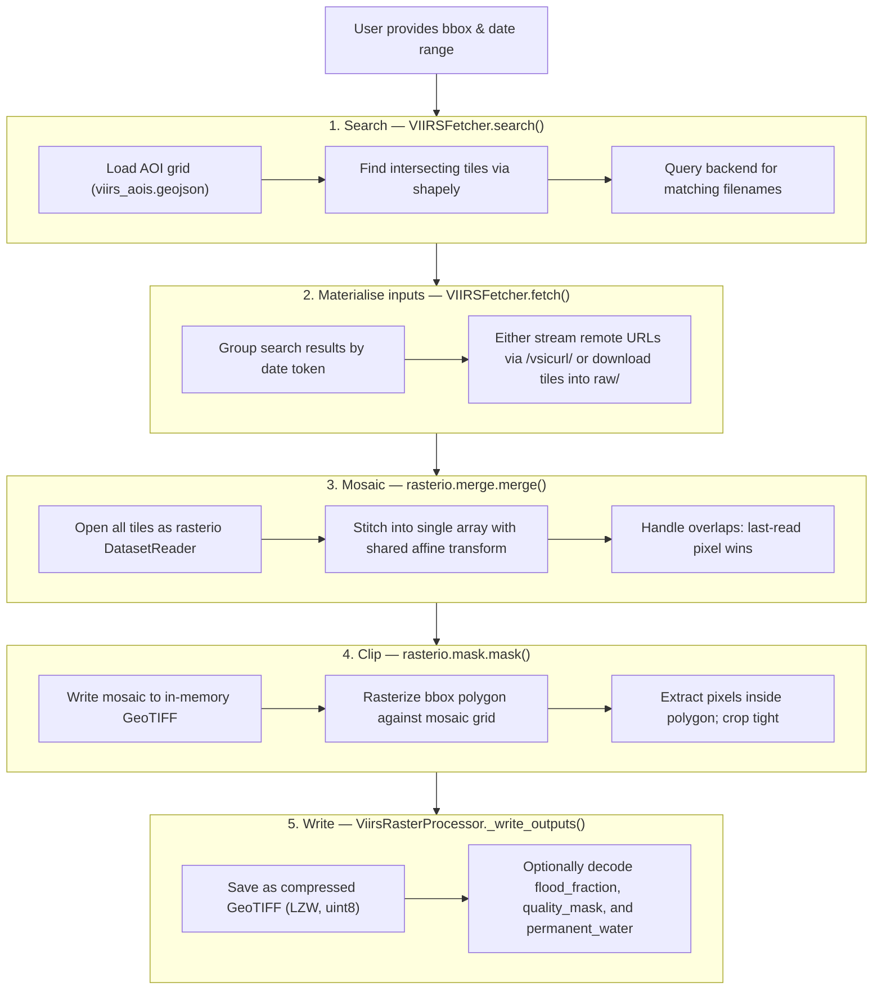

# VIIRS Internals

Developer-facing documentation for the VIIRS fetcher architecture and processing pipeline. For usage, see [overview.md](overview.md).

## Architecture

```
┌─────────────────────────────────────────────────────────┐
│                    VIIRSFetcher                         │
│              (orchestrates the flow)                    │
└─────────────┬───────────────────────┬───────────────────┘
              │                       │
              ▼                       ▼
┌─────────────────────┐    ┌──────────────────────┐
│   Backend Layer     │    │  ViirsRasterProcessor │
│                     │    │                      │
│ • NoaaS3Backend     │    │ • Mosaic tiles       │
│ • GmuLegacyBackend  │    │ • Clip to AOI        │
│                     │    │ • Classify pixels    │
│ Handles:            │    │ • Write GeoTIFFs     │
│ • URL building      │    │                      │
│ • Directory listing │    │                      │
│ • Filename matching │    │                      │
└─────────────────────┘    └──────────────────────┘
```

## Processing pipeline

When you run `atlantis fetch --source viirs`, the system executes a five-stage pipeline.
Stage 2 either streams remote GeoTIFFs via `/vsicurl/` or downloads them into `raw/`.
Stages 3 (Mosaic) and 4 (Clip) are the core raster operations, implemented in
`ViirsRasterProcessor._mosaic_and_clip()` inside `src/atlantis/fetchers/viirs/processor.py`.

### End-to-end flow



### Code trace

Call chain for a single date:

- `VIIRSFetcher.fetch()` in `__init__.py` orchestrates the per-date flow.
- `VIIRSFetcher.search()` in `__init__.py` finds intersecting AOIs and matching remote filenames.
- `VIIRSFetcher.fetch()` then either streams remote URLs directly to the processor or downloads tiles with `download_file()`.
- `ViirsRasterProcessor.process_tiles()` in `processor.py` constructs output paths and dispatches raster work.
- `ViirsRasterProcessor._mosaic_and_clip()` in `processor.py` runs `rasterio.merge.merge()` followed by `rasterio.mask.mask()`.
- `ViirsRasterProcessor._classify_pixels()` in `processor.py` derives `flood_fraction`, `quality_mask`, and `permanent_water` when classification is enabled.

## Stage 3 — Mosaic

VIIRS flood products are pre-tiled into ~10°×10° grid cells called **AOIs** (Areas of Interest).
If a bounding box straddles a tile boundary, `search()` returns multiple tiles for the same date
which must be merged before clipping.

### How `rasterio.merge.merge()` works

`merge()` takes a list of opened `DatasetReader` objects and produces:

| Output      | Description                                                                       |
| ----------- | --------------------------------------------------------------------------------- |
| `mosaic`    | A 3D numpy array `(bands, rows, cols)` spanning the union extent of all inputs    |
| `transform` | A single `Affine` mapping pixel coordinates to geographic coordinates (EPSG:4326) |

Under the hood it:

1. Computes the **union bounding box** — the smallest rectangle containing every input tile
2. Creates an **output grid** at native resolution (375 m), big enough for the union
3. Copies each input tile's pixels into the correct position within the output grid
4. Where tiles overlap, the **last-read tile's pixels win** (rasterio default `method='last'`)

### Overlap resolution

VIIRS AOI tiles intentionally overlap by a small margin along edges — this is the NOAA
product design. `merge()`'s default `method='last'` is appropriate because all tiles are
from the same sensor at the same resolution; pixels in the seam are identical regardless
of which tile "wins."

```
   Tile GLB023                    Tile GLB024
  ┌──────────────┐              ┌──────────────┐
  │              │              │              │
  │    ░░░░░░    │              │    ░░░░░░    │
  │    ░░░░░░    │              │    ░░░░░░    │
  │    ░░░░░░    │              │    ░░░░░░    │
  └──────────────┘              └──────────────┘
         │                            │
         └────────── merge() ─────────┘
                      │
                      ▼
             ┌────────────────────┐
             │     ░░░░░░░░░░     │
             │     ░░░░░░░░░░     │  ← overlap zone:
             │     ░░░░░░░░░░     │    GLB024 pixels win
             └────────────────────┘
```

For alternative overlap strategies, pass `method='max'` or `method='first'` to `merge()`.

If only one tile matches the bbox, `merge()` returns it unchanged (no special-casing needed).

## Stage 4 — Clip

After mosaicing, the raster covers all matching AOI tiles — always larger than the
requested bbox. The clip step trims it to the user's region.

### How `rasterio.mask.mask()` works

`mask()` takes a raster dataset and one or more Shapely geometries and returns:

| Output              | Description                                                                       |
| ------------------- | --------------------------------------------------------------------------------- |
| `clipped`           | A 3D numpy array `(bands, rows, cols)` containing only pixels inside the geometry |
| `clipped_transform` | A new `Affine` for the clipped extent                                             |

With `crop=True`:

1. **Masks** — pixels whose centers fall outside the polygon are set to `nodata` (0)
2. **Crops** — the output array is trimmed to the tight bounding rectangle of the polygon

This is all-or-nothing at the pixel level — appropriate for 375 m data where sub-pixel
clipping would be meaningless.

```
   Mosaic (union of tiles)          After mask(crop=True)
  ┌────────────────────────┐       ┌──────────────────┐
  │  ·  ·  ·  ·  ·  ·  ·  │       │   █  █  █  █  █  │
  │  ·  ░  ░  ░  ░  ░  ·  │       │   █  █  █  █  █  │
  │  ·  ░  ░  ░  ░  ░  ·  │  →    │   █  █  █  █  █  │
  │  ·  ░  ░  ░  ░  ░  ·  │       │   █  █  █  █  █  │
  │  ·  ░  ░  ░  ░  ░  ·  │       └──────────────────┘
  │  ·  ·  ·  ·  ·  ·  ·  │        █ = kept    · = discarded
  └────────────────────────┘
```

### In-memory buffering

`_mosaic_and_clip()` writes the mosaic into a `rasterio.io.MemoryFile` before calling
`mask()`. This is because `mask()` expects a GDAL-compatible dataset handle — it can't
operate directly on a numpy array. The `MemoryFile` provides that handle without
touching disk.

## Stage 5 — Classify

Unless `--no-classify` is passed, `_classify_pixels()` decodes raw VIIRS integer codes
into one continuous flood layer plus two binary masks:

| Layer             | Rule                                           | Meaning                                                                 |
| ----------------- | ---------------------------------------------- | ----------------------------------------------------------------------- |
| `flood_fraction`  | `101 <= pixel <= 200 ? (pixel - 100) / 100 : 0` | Flooded-water fraction in `[0.0, 1.0]`; written as uint8 percent `[0,100]` |
| `quality_mask`    | `pixel ∉ {0,1,30}`                             | 1 = valid clear-sky observation (0 = fill or cloud cover)               |
| `permanent_water` | `pixel == 17`                                  | 1 = known permanent water body                                          |

Water types (17=permanent, 20=seasonal, 99=open) are **valid observations** — they
receive `quality=1`, contribute `0` to `flood_fraction`, and permanent water is tracked
through its own classification.

There is no thresholding step inside `_classify_pixels()` in the current pipeline. If you
need a binary flood mask, apply a downstream threshold to `flood_fraction`.

Classification runs **after** mosaic and clip, so it only processes pixels inside the
bbox — saving computation on discarded regions.

## Edge cases

| Scenario                            | Behaviour                                                |
| ----------------------------------- | -------------------------------------------------------- |
| Bbox inside a single tile           | `merge()` is a no-op on one tile; `mask()` crops it      |
| Bbox spans 2+ tiles                 | `merge()` stitches them; `mask()` crops the union        |
| Bbox covers an entire tile exactly  | `mask()` returns the tile unchanged (crop has no effect) |
| No tiles match the bbox             | `search()` returns `[]`; `fetch()` returns `[]` early    |
| Backend returns no files for a date | That date is silently skipped                            |
