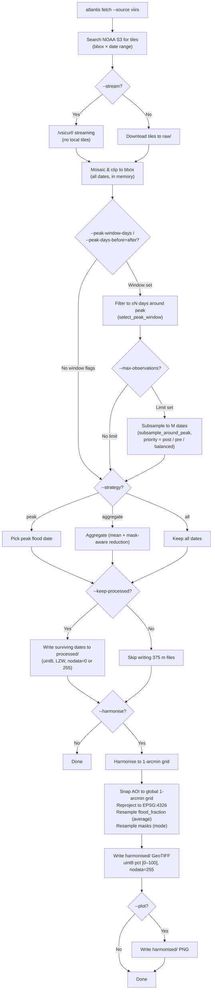

# VIIRS Pipeline Modes

Overview of the user-facing pipeline paths depending on flag combinations.

## Decision flowchart



## Mode summary

| Strategy    | --keep-processed | Intermediate output              | Final output | Flood variable               |
| :---------- | :--------------- | :------------------------------- | :----------- | :--------------------------- |
| `peak`      | Yes              | `processed/*_flood_fraction.tif` | —            | `flood_fraction` (uint8 pct) |
| `peak`      | No               | _(none)_                         | —            | `flood_fraction` (uint8 pct) |
| `aggregate` | Yes              | `processed/*_flood_fraction.tif` | —            | `flood_fraction` (mean)      |
| `all`       | Yes              | `processed/*_flood_fraction.tif` | —            | `flood_fraction` (N dates)   |
| `all`       | No               | _(none)_                         | —            | `flood_fraction` (N dates)   |

_Note: `--harmonise` adds a final `harmonised/_\_harmonised.tif` output for any strategy.\*

## Strategies in detail (pixel-level)

After the per-date "Mosaic & clip" stage, every date in the requested
window has produced a `ProcessedTile`, all on the **same 375 m grid** for the
bbox. The layers depend on the chosen **kind** (see [the layer reference](../layers.md)):

The exact native/derived VIIRS inventory is centralised in the canonical
[layer reference](../layers.md#layers-viirs). At this stage, the important
encoding distinction is:

- the fraction layers are written as uint8 percentages (`0–100`, `nodata=255`),
- the categorical masks stay uint8 `0/1`,
- the native `raw` layer preserves the original VFM codes.

The strategy controls how those `N`-date stacks are reduced to the output
written under `processed/` (and later `harmonised/`):

### `peak` — pick the single most-flooded date

Implemented in [`atlantis.fetchers.viirs.selection.flood_pixel_count`](../../src/atlantis/fetchers/viirs/selection.py)
and dispatched in `VIIRSFetcher.fetch`.

For each date `d`, count the flooded pixels:

$$
\text{flood\_count}_d = \sum_{(i,j)} \mathbb{1}\!\left[\text{flood\_fraction}_d(i,j) > 0\right]
$$

(or, with `--no-classify`, the count of raw codes in `[101, 200]` — the
VFM "supra-snow / supra-veg" water classes).

Pick:

$$
d^{\star} = \arg\max_d \text{flood\_count}_d
$$

and return **only** the `ProcessedTile` for `d⋆`. Ties go to the **earliest**
date (first to reach the max during iteration). No pixel-level merging
happens — the output rasters are byte-identical to the chosen date's
mosaic.

### `aggregate` — temporal composite (mean / mode)

Implemented in [`ViirsRasterProcessor.aggregate_tiles`](../../src/atlantis/fetchers/viirs/processor.py).

All `N` dates are stacked into a `(N, H, W)` array per layer and reduced
**element-wise** by [`atlantis.layers.aggregate_layer`](../../src/atlantis/layers/aggregation.py),
using the operator declared for each layer in the
[VIIRS layer registry](../layers.md#layers-viirs):

| Layer                                | Operator     | Rationale                                                    |
| :----------------------------------- | :----------- | :----------------------------------------------------------- |
| `water_fraction`                     | `nanmean`    | Continuous variable → arithmetic mean                        |
| `flood_fraction`                     | `nanmean`    | Continuous variable → arithmetic mean                        |
| `exclusion_mask`                     | `all_true`   | Excluded only if every observation was fill/cloud            |
| `reference_water`                    | `majority`   | Ignore excluded dates when reducing the reference-water mask |
| `cloud_mask` / `snow_ice` / `shadow` | `mode`       | Categorical 0/1 derived masks → most-frequent value          |
| `raw`                                | `mode`       | Categorical VFM codes → most-frequent value                  |
| `cloud_fraction`                     | scalar       | Per-tile metadata (`np.mean`), not a pixel array             |

> **Why `all_true` / `majority` for VIIRS?** VIIRS is optical, so cloud and
> fill gaps are common. `exclusion_mask` therefore uses a conservative rule: a
> pixel is excluded only if **every** date in the stack was fill/cloud. Because
> those excluded dates should not vote on `reference_water`, it is reduced by a
> strict majority over usable (non-excluded) observations only.

Important properties:

- **`nanmean`** for `flood_fraction` means cloud/no-data pixels (NaN at
  this stage, encoded as `255` only at write-time) are **skipped per-pixel** —
  a pixel that was clear on 3 of 5 dates averages those 3 dates only.
- **`exclusion_mask`** is intentionally conservative in aggregate mode: a pixel
  is marked excluded only if **every** observation in the stack was fill/cloud.
- **`reference_water`** is reduced only across dates where `exclusion_mask == 0`;
  ties resolve to `0`, so the aggregate output requires a strict majority of
  usable observations to mark a pixel as reference water.
- **Mode** for the categorical layers is computed by
  `_mode_uint8`: a per-pixel `np.bincount` over the time axis, with
  ties broken by the **lowest value** (`argmax` returns the first index).
- The aggregated tile inherits `transform`, `crs`, and bbox from the
  **first** date in the stack — all dates already share that grid by
  construction.
- Output `date_token` is the literal string `"aggregated"` (this is why
  the harmonised filename is `<event>_aggregated_viirs_harmonised.tif`).

### `all` — keep every date independently

No pixel-level reduction. Each date's `ProcessedTile` becomes its own
`FetchResult`, and (when `--harmonise`) each is harmonised separately to
its own GeoTIFF + PNG. Useful for time-series analysis; the output count
equals the number of dates with successful tile coverage.

## Data encoding at each stage

```
Raw tiles (NOAA S3)          uint8   codes 0–200         375 m
        │
        ▼
Processed (--classify)       uint8   water pct 0–100     375 m, nodata=255
           uint8   flood pct 0–100     375 m, nodata=255
           uint8   reference water 0/1 375 m, nodata=0
           uint8   exclusion 0/1       375 m, nodata=0
        │
        ▼
Harmonised                   uint8   flood pct 0–100     ~1 arcmin, nodata=255
                                     (average resampled)


Raw tiles (NOAA S3)          uint8   codes 0–200         375 m
        │
        ▼
Processed (--no-classify)    uint8   raw codes 0–200     375 m, nodata=0
        │
        ▼
Harmonised (raw)             uint8   raw codes 0–200     ~1 arcmin, nodata=255
                                     (nearest resampled, normalisation skipped)
```

## Notes

- **No-keep-processed** skips writing intermediate 375 m files — saves ~100 MB per event.
- **Raw + harmonise** uses nearest-neighbour resampling (preserves integer codes) but emits a warning that the result is not a continuous flood fraction.
- The normaliser's `skip_normalise_vars` set includes `"raw"` — raw codes are never min-max normalised even if passed through the full harmonisation pipeline.
- **Resampling methods** are configured in `variable_resampling`: `water_fraction → average`, `flood_fraction → average`, `reference_water → mode`, `exclusion_mask → mode`, `raw → nearest`.
- **Global grid alignment** — by default, harmonised AOIs are snapped to
  the canonical 1-arcmin grid (`origin = (-180, +90)`, `res = 1/60°`) so
  every output is a bit-for-bit subset of the same global raster
  (compatible with ECMWF `Globe_flood_area_*.grb` and other 1-arcmin
  global products). See
  [Canonical 1-arcmin global grid](overview.md#canonical-1-arcmin-global-grid)
  for details and the verification notebook.

## Window filter algorithm

Implemented in [`atlantis.fetchers.viirs.selection`](../../src/atlantis/fetchers/viirs/selection.py)
and dispatched inside `VIIRSFetcher._apply_peak_window()`.

### Step 1 — Find the peak

All dates are processed in memory (mosaic + clip + classify). The peak date $d^*$ is
the one with the maximum flood-pixel count:

$$
d^* = \arg\max_d \sum_{(i,j)} \mathbb{1}\!\left[\text{flood\_fraction}_d(i,j) > 0\right]
$$

Ties are broken by the **earliest** date (first during iteration), consistent with the
existing `peak` strategy.

### Step 2 — Apply the window (`select_peak_window`)

Given `--peak-days-before B` and `--peak-days-after A`, retain only dates $d$ satisfying:

$$
d^* - B \;\le\; d \;\le\; d^* + A
$$

Setting both `B = A = 0` (the default) returns all dates unchanged. Non-parseable
tokens such as `"aggregated"` are always excluded from windowing.

### Step 3 — Subsample (`subsample_around_peak`)

If `--max-observations M` is set and the window contains more than $M$ dates, a subset
of exactly $M$ is chosen. The peak $d^*$ is **always included**. The remaining $M - 1$
slots are filled according to `--peak-priority`:

| Priority   | Fill order                                           |
| :--------- | :--------------------------------------------------- |
| `post`     | Closest post-peak dates first, then closest pre-peak |
| `pre`      | Closest pre-peak dates first, then closest post-peak |
| `balanced` | Alternating: $d^*+1$, $d^*-1$, $d^*+2$, $d^*-2$, …   |

The returned list is always in **chronological order**.

### Step 4 — Write survivors only

With `--keep-processed`, only the surviving dates are written to `processed/`.
This ensures no orphan GeoTIFFs accumulate when a wide search window is combined
with strict subsampling.
