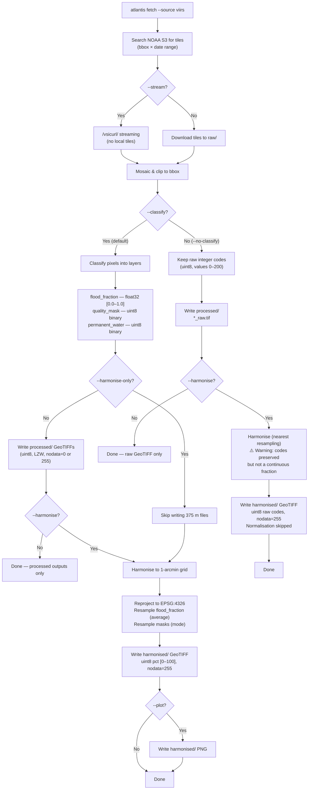

# VIIRS Pipeline Modes

Overview of the user-facing pipeline paths depending on flag combinations.

## Decision flowchart



## Mode summary

| Flags                       | Intermediate output                      | Final output                  | Flood variable                           |
| --------------------------- | ---------------------------------------- | ----------------------------- | ---------------------------------------- |
| _(defaults)_                | `processed/*_flood_fraction.tif` + masks | —                             | `flood_fraction` (uint8 pct, nodata=255) |
| `--harmonise`               | `processed/*_flood_fraction.tif` + masks | `harmonised/*_harmonised.tif` | `flood_fraction` (uint8 pct, nodata=255) |
| `--harmonise-only`          | _(none)_                                 | `harmonised/*_harmonised.tif` | `flood_fraction` (uint8 pct, nodata=255) |
| `--no-classify`             | `processed/*_raw.tif`                    | —                             | `raw` (uint8 codes 0–200)                |
| `--no-classify --harmonise` | `processed/*_raw.tif`                    | `harmonised/*_harmonised.tif` | `raw` (uint8 codes, nearest resampling)  |

## Data encoding at each stage

```
Raw tiles (NOAA S3)          uint8   codes 0–200         375 m
        │
        ▼
Processed (--classify)       uint8   flood pct 0–100     375 m, nodata=255
                             uint8   quality 0/1         375 m, nodata=0
                             uint8   perm. water 0/1     375 m, nodata=0
        │
        ▼
Harmonised                   uint8   flood pct 0–100     ~1 arcmin, nodata=255
                                     (average resampled)


Raw tiles (NOAA S3)          uint8   codes 0–200         375 m
        │
        ▼
Processed (--no-classify)    uint8   raw codes 0–200     375 m, nodata=0
        │
        ▼
Harmonised (raw)             uint8   raw codes 0–200     ~1 arcmin, nodata=255
                                     (nearest resampled, normalisation skipped)
```

## Notes

- **Harmonise-only** skips writing intermediate 375 m files — saves ~100 MB per event.
- **Raw + harmonise** uses nearest-neighbour resampling (preserves integer codes) but emits a warning that the result is not a continuous flood fraction.
- The normaliser's `skip_normalise_vars` set includes `"raw"` — raw codes are never min-max normalised even if passed through the full harmonisation pipeline.
- **Resampling methods** are configured in `variable_resampling`: `flood_fraction → average`, `quality_mask → mode`, `permanent_water → mode`, `raw → nearest`.
