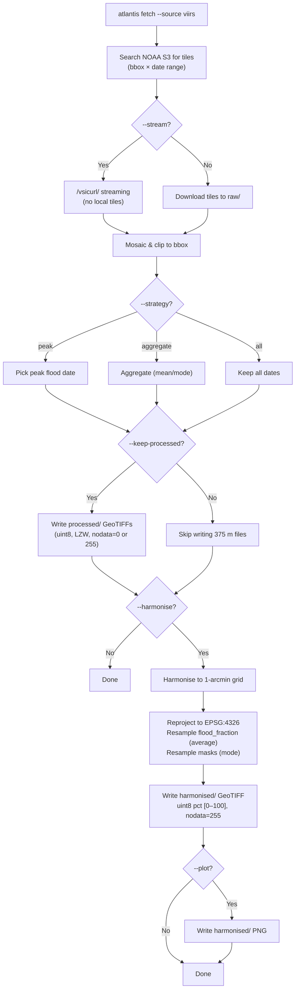

# VIIRS Pipeline Modes

Overview of the user-facing pipeline paths depending on flag combinations.

## Decision flowchart



## Mode summary

| Strategy    | --keep-processed | Intermediate output              | Final output | Flood variable               |
| :---------- | :--------------- | :------------------------------- | :----------- | :--------------------------- |
| `peak`      | Yes              | `processed/*_flood_fraction.tif` | —            | `flood_fraction` (uint8 pct) |
| `peak`      | No               | _(none)_                         | —            | `flood_fraction` (uint8 pct) |
| `aggregate` | Yes              | `processed/*_flood_fraction.tif` | —            | `flood_fraction` (mean)      |
| `all`       | Yes              | `processed/*_flood_fraction.tif` | —            | `flood_fraction` (N dates)   |
| `all`       | No               | _(none)_                         | —            | `flood_fraction` (N dates)   |

_Note: `--harmonise` adds a final `harmonised/_\_harmonised.tif` output for any strategy.\*

## Data encoding at each stage

```
Raw tiles (NOAA S3)          uint8   codes 0–200         375 m
        │
        ▼
Processed (--classify)       uint8   flood pct 0–100     375 m, nodata=255
                             uint8   quality 0/1         375 m, nodata=0
                             uint8   perm. water 0/1     375 m, nodata=0
        │
        ▼
Harmonised                   uint8   flood pct 0–100     ~1 arcmin, nodata=255
                                     (average resampled)


Raw tiles (NOAA S3)          uint8   codes 0–200         375 m
        │
        ▼
Processed (--no-classify)    uint8   raw codes 0–200     375 m, nodata=0
        │
        ▼
Harmonised (raw)             uint8   raw codes 0–200     ~1 arcmin, nodata=255
                                     (nearest resampled, normalisation skipped)
```

## Notes

- **No-keep-processed** skips writing intermediate 375 m files — saves ~100 MB per event.
- **Raw + harmonise** uses nearest-neighbour resampling (preserves integer codes) but emits a warning that the result is not a continuous flood fraction.
- The normaliser's `skip_normalise_vars` set includes `"raw"` — raw codes are never min-max normalised even if passed through the full harmonisation pipeline.
- **Resampling methods** are configured in `variable_resampling`: `flood_fraction → average`, `quality_mask → mode`, `permanent_water → mode`, `raw → nearest`.
